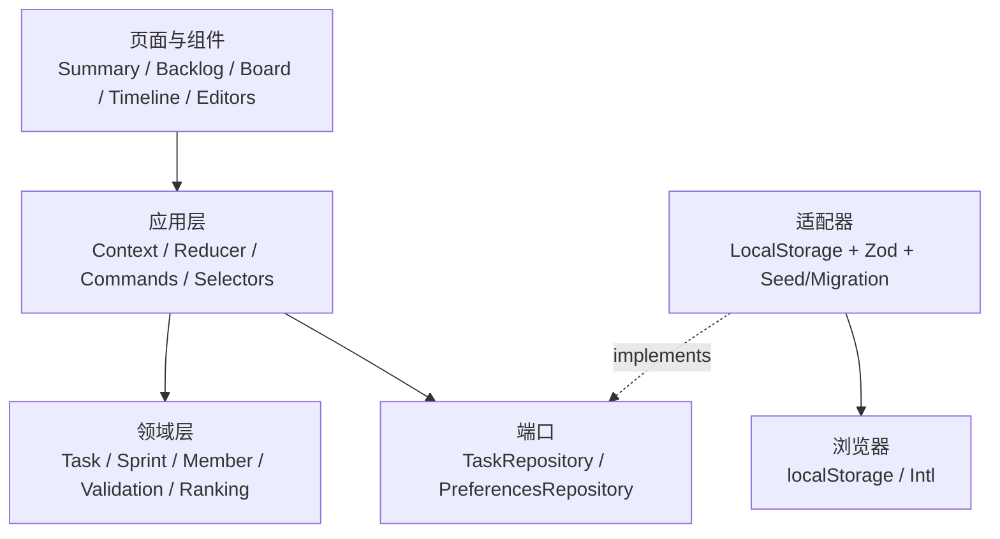
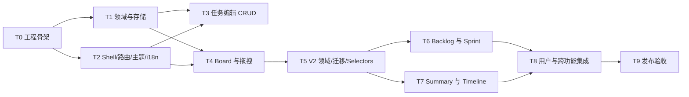

# ForceTrack MVP 技术设计与实施计划

> 文档版本：v1.0  
> 日期：2026-08-11  
> 关联需求：[PRD.md](./PRD.md)  
> 实施状态：T0–T4 已完成；本文保留其定义，不回改已完成范围<br>
> 剩余周期：T5–T9 预计约 9 小时，建议拆为 1–1.5 个工作日<br>
> 目标：在现有 Board/CRUD 基础上补齐 Summary、Backlog、Timeline、Sprint 与本地用户能力，并保持可逐步验收和后续云端演进空间

## 1. 技术目标与约束

### 1.1 技术目标

- 完成任务创建、编辑、删除、流转和持久化的完整闭环。
- Summary、Backlog、Board 与 Timeline 使用同一份领域状态，避免跨视图数据不一致。
- 以 Jira Scrum 的基本心智模型管理 Backlog、未来 Sprint 和单一活动 Sprint。
- 支持创建本地用户并用于负责人、报告人和工作量汇总，但不模拟真实账号体系。
- 中英文、主题和浏览器本地数据刷新后保持。
- 核心规则由纯函数承载并可快速单元测试。
- 页面组件不直接依赖 `localStorage`，未来可替换为远程 API。
- 每个实施任务都有独立输出和验收门槛，失败时尽早暴露。

### 1.2 工程约束

- T0–T4 已完成，后续任务必须兼容现有工程、领域模型、任务编辑器与 Board，不返工已验收能力。
- MVP 为纯前端单页应用，不建设服务端、数据库或真实认证。
- 首要验收环境为桌面端最新版 Chrome，主视口为 1280×720。
- 目标数据量为 100 条以内任务，不为更大规模提前引入虚拟列表或复杂缓存。
- 所有 P1 功能必须在 P0 完整通过后才能开始。

### 1.3 本次范围变更

本次在原 PRD 基础上将以下能力提升为剩余阶段的必做范围：

- 新增 `Summary` Tab：提供概览卡、状态、优先级、成员负载和最近活动。
- 新增 `Backlog` Tab：展示未来/活动 Sprint 与未排期 Backlog，支持任务排序和跨区移动。
- 新增 Sprint 生命周期：创建、编辑、启动、完成和删除。
- 新增本地用户：查看成员、创建成员，并作为任务负责人/报告人使用。
- Board 调整为活动 Sprint 的执行视图；无活动 Sprint 时展示引导进入 Backlog 启动 Sprint。

为遵守“无需真实登录、多人协作”的原始边界，本地用户不发送邀请、不区分角色与权限，也不代表真实在线身份。Jira 的批量编辑、并行 Sprint、报表、通知、评论和成员访问控制仍不进入本轮。

## 2. 技术选型结论

### 2.1 运行环境与版本基线

以下版本为 2026-08-11 的实现基线。初始化后必须提交 `pnpm-lock.yaml`，后续构建以锁文件为准，不自动追随最新版本。

| 类别 | 选择 | 基线版本 | 用途 |
| --- | --- | ---: | --- |
| 运行时 | Node.js | 24.x | 本地开发、构建和测试 |
| 包管理器 | pnpm | 10.x | 快速、确定性依赖安装 |
| UI 框架 | React | 19.2.x | 组件化客户端界面 |
| 语言 | TypeScript | 7.0.x，strict | 领域模型、动作和组件契约 |
| 构建工具 | Vite | 8.2.x | 开发服务器与静态生产构建 |
| 路由 | React Router | 8.3.x，Declarative Mode | `/board`、`/timeline` 和回退路由 |
| 样式 | Tailwind CSS | 4.3.x | 快速实现布局与状态样式 |
| 设计令牌 | CSS custom properties | 原生 | 明暗主题和语义色 |
| 拖拽 | `@dnd-kit/core` + `@dnd-kit/sortable` | 6.3.x / 10.0.x | 多列拖拽、列内排序和键盘传感器 |
| 国际化 | i18next + react-i18next | 26.3.x / 17.0.x | 中英文资源和即时切换 |
| 日期计算 | date-fns | 4.4.x | 日期范围、日历日差和逾期判断 |
| 运行时校验 | Zod | 4.4.x | 本地存储数据校验与损坏恢复 |
| 弹窗基础能力 | Radix Dialog | 1.1.x | 焦点锁定、Escape、无障碍语义 |
| 图标 | Lucide React | 1.31.x | 统一的轻量图标 |
| 单元/组件测试 | Vitest + Testing Library | 4.1.x / 16.3.x | 领域逻辑和关键组件行为 |
| 端到端测试 | Playwright | 1.62.x | 真实浏览器主流程与持久化验证 |
| 代码质量 | ESLint + Prettier | 10.8.x / 3.9.x | 静态检查与统一格式 |

安装时允许使用同一主版本内更新的补丁版本；若出现 peer dependency 或类型不兼容，优先回退单个依赖，而不是更换整体架构。

### 2.2 选择理由

#### React + TypeScript + Vite

- 应用是交互密集型客户端界面，组件状态、拖拽和多视图共享数据适合 React。
- TypeScript 的联合类型可以固定任务状态和优先级，减少字符串状态漂移。
- Vite 官方提供 React + TypeScript 模板和 React 插件，初始化成本低，适合一天时间盒。
- 使用 SPA 而非 SSR：本产品没有 SEO、服务端数据加载或首屏个性化要求，SSR 只会增加部署和调试面。

#### React Router Declarative Mode

- Board 与 Timeline 需要可直接访问、可刷新保持的 URL。
- Declarative Mode 只提供当前所需的路由、导航和选中态，不引入服务端 loader/action。
- 默认路由 `/` 重定向至 `/board`，未知路径重定向至 `/board`。

#### React Context + `useReducer`，不引入 Redux/Zustand

- 100 条以内任务和两个主页面不需要复杂状态框架。
- reducer 和 selectors 可以作为纯函数测试，动作边界清楚。
- Repository 独立处理持久化，使状态层不与 `localStorage` 绑定。
- 后续出现服务端缓存、乐观更新和多人同步时，再评估 TanStack Query 或专用状态方案。

#### Tailwind CSS + CSS 语义令牌

- Tailwind 用于快速完成布局、间距、响应式和交互状态。
- 颜色不直接散落为具体色值，而映射到 `--surface`、`--text`、`--border`、`--accent`、`--danger` 等变量。
- `html[data-theme]` 控制主题，Tailwind 类消费语义变量，后续替换品牌色不需要重写组件。
- 不引入完整组件库；MVP 只使用 Radix Dialog 解决最容易出错的弹窗焦点管理，其余使用原生语义控件。

#### dnd-kit

- Sortable preset 支持单列和多容器排序，并提供 Pointer 与 Keyboard sensors。
- 空列显式注册为 droppable，保证任务能移入空状态列。
- 仅在 `onDragEnd` 提交持久化变更；拖拽过程中的预览是临时 UI 状态，避免高频写存储。
- 任务详情中的状态下拉框始终保留，既是键盘替代路径，也是拖拽异常时的可靠兜底。

#### i18next + react-i18next

- 所有固定文案以稳定 key 管理，组件不保存中英文字符串分支。
- 仅打包 `zh-CN` 与 `en-US` 两份本地 JSON，不接远程翻译服务。
- 浏览器语言识别使用少量自有逻辑，不额外引入 language detector。

#### Vitest + Testing Library + Playwright

- Vitest 与 Vite 共享模块解析和 TypeScript/JSX 配置，适合快速测试纯逻辑与组件。
- Testing Library 按用户可见角色、标签和文本测试交互，减少对 DOM 实现细节的依赖。
- Playwright 验证真实浏览器中的拖拽、本地持久化、路由、主题和跨视图同步。

### 2.3 暂不选择的方案

| 方案 | 本次不选原因 | 何时重新评估 |
| --- | --- | --- |
| Next.js / React Router Framework Mode | 无 SSR、SEO、服务端 action 需求，增加工程面 | 接入后端、鉴权或需要 SSR 时 |
| Redux Toolkit / Zustand | 当前状态规模小，Context + reducer 已足够 | 实时协作、复杂异步缓存或性能出现证据时 |
| IndexedDB | 100 条任务可由 `localStorage` 满足，IndexedDB 测试成本更高 | 附件、离线队列或大数据量时 |
| 完整 UI 组件库 | 视觉定制和依赖体积超出 MVP 所需 | 表单与复杂组件数量显著增长时 |
| 甘特图库 | Timeline 仅需只读日期条，引入后会增加样式与授权评估 | 需要依赖、缩放、拖拽排期时 |
| 后端/API Mock 框架 | MVP 无网络请求，不需要 MSW | 开始接入真实 API 时 |

## 3. 总体架构

### 3.1 分层



依赖只允许从上层指向下层契约：

- 页面组件通过 commands 触发业务动作，不直接调用 `localStorage`。
- reducer 只接收已定义 action，不包含 DOM、路由或存储副作用。
- 日期、筛选、排序、校验均为独立纯函数。
- Repository 返回领域对象或明确错误，不向 UI 泄露原始 JSON。

### 3.2 状态与数据流

```text
用户操作
  → command 校验输入
  → 生成下一个领域状态
  → reducer 更新内存状态
  → repository 保存版本化快照
  → 保存失败则保留当前界面状态，并显示“刷新后可能丢失”的非阻塞错误
```

启动流程：

1. `LocalTaskRepository.load()` 读取并校验存储快照。
2. 无数据时写入演示数据。
3. 数据合法时 hydrate 应用状态。
4. 数据损坏时备份损坏字符串到单独 key、恢复演示数据并返回 `recovered` 状态。
5. UI 展示一次非阻塞恢复提示，应用不得白屏。

### 3.3 路由

| URL | 页面 | 行为 |
| --- | --- | --- |
| `/` | 无 | 重定向至 `/board` |
| `/summary` | Summary | 项目概览与派生统计 |
| `/backlog` | Backlog | Sprint 规划、任务排序与成员入口 |
| `/board` | Board | 默认主页面 |
| `/timeline` | Timeline | 时间线页面 |
| `*` | 无 | 重定向至 `/board` |

任务详情不写入独立路由，MVP 使用应用级 Dialog。后续需要分享任务链接时，再增加 `/tasks/:taskId` 并复用同一编辑组件。

## 4. 目录与模块设计

```text
ForceTrack/
├── e2e/
│   ├── board.spec.ts
│   ├── backlog.spec.ts
│   ├── preferences.spec.ts
│   ├── summary.spec.ts
│   └── timeline.spec.ts
├── public/
├── src/
│   ├── app/
│   │   ├── App.tsx
│   │   ├── AppProviders.tsx
│   │   └── routes.tsx
│   ├── components/
│   │   ├── AppHeader.tsx
│   │   ├── EmptyState.tsx
│   │   └── FeedbackBanner.tsx
│   ├── features/
│   │   ├── summary/
│   │   │   ├── SummaryPage.tsx
│   │   │   └── summary-selectors.ts
│   │   ├── backlog/
│   │   │   ├── BacklogPage.tsx
│   │   │   ├── BacklogSection.tsx
│   │   │   ├── SprintDialog.tsx
│   │   │   ├── CompleteSprintDialog.tsx
│   │   │   ├── MemberDialog.tsx
│   │   │   └── backlog-dnd.ts
│   │   ├── board/
│   │   │   ├── BoardPage.tsx
│   │   │   ├── BoardColumn.tsx
│   │   │   ├── TaskCard.tsx
│   │   │   └── board-dnd.ts
│   │   ├── filters/
│   │   │   ├── FilterBar.tsx
│   │   │   └── task-selectors.ts
│   │   ├── task-editor/
│   │   │   ├── TaskDialog.tsx
│   │   │   ├── TaskForm.tsx
│   │   │   └── task-validation.ts
│   │   └── timeline/
│   │       ├── TimelinePage.tsx
│   │       ├── TimelineGrid.tsx
│   │       └── timeline-range.ts
│   ├── domain/
│   │   ├── task.ts
│   │   ├── member.ts
│   │   ├── sprint.ts
│   │   ├── actions.ts
│   │   └── task-reducer.ts
│   ├── infrastructure/
│   │   ├── repositories.ts
│   │   ├── local-task-repository.ts
│   │   ├── local-preferences-repository.ts
│   │   ├── storage-schema.ts
│   │   └── seed-data.ts
│   ├── i18n/
│   │   ├── index.ts
│   │   └── locales/
│   │       ├── en-US.json
│   │       └── zh-CN.json
│   ├── styles/
│   │   ├── index.css
│   │   └── tokens.css
│   ├── test/
│   │   ├── setup.ts
│   │   └── fixtures.ts
│   └── main.tsx
├── index.html
├── playwright.config.ts
├── vite.config.ts
├── vitest.config.ts
└── package.json
```

测试文件优先与被测模块同目录放置，例如 `task-reducer.test.ts`；`src/test` 只存放通用 setup 和 fixtures。

## 5. 关键技术设计

### 5.1 领域模型

T0–T4 的 `TaskSnapshotV1` 保持为输入兼容格式；新增能力使用显式的 `TaskSnapshotV2`，不得继续向 V1 静默追加字段：

```ts
interface Task extends TaskV1 {
  sprintId: string | null;
  reporterId: string | null;
  rank: number; // Backlog/Sprint 中的全局相对顺序
}

type SprintStatus = "planned" | "active" | "completed";

interface Sprint {
  id: string;
  name: string;
  goal: string;
  startDate: string | null;
  endDate: string | null;
  status: SprintStatus;
  position: number; // 未来 Sprint 的显示顺序
  createdAt: string;
  startedAt: string | null;
  completedAt: string | null;
}

interface Member {
  id: string;
  name: string;
  email: string;
  avatar?: string;
  createdAt: string;
}

interface TaskSnapshotV2 {
  schemaVersion: 2;
  nextTaskNumber: number;
  tasks: Task[];
  members: Member[];
  sprints: Sprint[];
}

interface TaskRepository {
  load(): Promise<LoadResult>;
  save(snapshot: TaskSnapshotV2): Promise<void>;
}

type LoadResult =
  | { kind: "loaded"; snapshot: TaskSnapshotV2 }
  | { kind: "migrated"; snapshot: TaskSnapshotV2 }
  | { kind: "seeded"; snapshot: TaskSnapshotV2 }
  | { kind: "recovered"; snapshot: TaskSnapshotV2 };
```

Repository 即使使用同步 `localStorage` 也返回 Promise，使未来远程实现无需改变调用方函数签名。

领域约束：

- 最多只能有一个 `active` Sprint；本轮不支持 Jira 的 parallel sprints。
- `planned` Sprint 可以编辑、启动或删除；`active` Sprint 可以编辑或完成；`completed` Sprint 只读保留。
- 启动 Sprint 时至少包含一条任务，并要求名称、开始日期、结束日期合法。
- 完成 Sprint 时，`done` 任务保留在已完成 Sprint；未完成任务必须明确移动到 Backlog 或一个 `planned` Sprint。
- 删除 `planned` Sprint 时，其任务全部回到 Backlog；禁止直接删除活动或已完成 Sprint。
- Member email 去除首尾空格后按不区分大小写唯一；新增成员立即可用于 assignee/reporter。
- 删除/停用成员不在本轮，避免产生悬空任务引用。

### 5.2 Action 与 reducer

最小 action 集：

```ts
type TaskAction =
  | { type: "hydrate"; payload: TaskSnapshotV2 }
  | { type: "task/created"; payload: Task }
  | { type: "task/updated"; payload: Task }
  | { type: "task/deleted"; payload: { taskId: string } }
  | {
      type: "task/moved";
      payload: { taskId: string; toStatus: TaskStatus; toIndex: number };
    }
  | {
      type: "backlog/task-ranked";
      payload: { taskId: string; sprintId: string | null; toIndex: number };
    }
  | { type: "sprint/created"; payload: Sprint }
  | { type: "sprint/updated"; payload: Sprint }
  | { type: "sprint/started"; payload: { sprintId: string; startedAt: string } }
  | {
      type: "sprint/completed";
      payload: {
        sprintId: string;
        completedAt: string;
        incompleteTargetSprintId: string | null;
      };
    }
  | { type: "sprint/deleted"; payload: { sprintId: string } }
  | { type: "member/created"; payload: Member };
```

规则：

- `id` 使用 `crypto.randomUUID()`；展示编号使用快照内 `nextTaskNumber` 生成 `FT-n`。
- 创建、编辑和移动均更新 `updatedAt`。
- 移动后仅对来源列和目标列的 `position` 重新编号为连续整数。
- Backlog 排序只修改 `rank` 和 `sprintId`，不得意外修改任务工作流 `status`。
- Sprint 完成必须在一个 reducer action 内迁移全部未完成任务，保证快照原子一致。
- reducer 不读当前时间；command 生成时间并随 payload 传入，保证测试确定性。
- 任何 action 不得原地修改 state。

### 5.3 本地存储

存储 key：

| Key | 内容 |
| --- | --- |
| `forcetrack:tasks:v2` | 当前 `TaskSnapshotV2` |
| `forcetrack:tasks:v1` | 只读迁移来源，不再写入 |
| `forcetrack:preferences:v1` | `UserPreferences` |
| `forcetrack:recovery:last-invalid` | 最近一次损坏的原始数据，仅用于调试 |

要求：

- 启动时先读取并校验 V2；V2 不存在时才读取 V1 并执行一次确定性迁移。
- V1 → V2 时保留所有任务 ID、编号、状态、日期和 Board position；补充 `rank`、`reporterId`、`sprintId`，并生成可继续使用现有 Board 的初始 Sprint。
- 迁移成功写入 V2 后保留 V1 原文，不在同一事务中删除旧 key；失败则继续使用恢复流程。
- 读取后使用 Zod 校验，不能直接类型断言。
- 只有 key 不存在时才生成 seed；合法空数组代表用户确实删除了所有任务。
- 写入采用完整快照，100 条以内数据不需要增量日志。
- 捕获 JSON 解析、安全模式、配额和不可用存储错误。
- 未来新增 schema 时，通过 `schemaVersion` 逐版本迁移，禁止向旧版本 schema 静默追加默认字段。

### 5.4 表单与校验

- 使用受控表单和一个局部 draft，不引入表单框架。
- 标题先 `trim()`，结果长度必须为 1–100。
- 描述最多 2,000 字符。
- 日期保存为 `YYYY-MM-DD`，表示本地日历日期，不转换为 UTC 时间戳。
- 同时有开始和截止日期时，`dueDate >= startDate`。
- 是否有未保存修改通过规范化后的 draft 与原任务比较。
- 放弃修改确认使用应用内 Dialog，不调用阻塞式 `window.confirm`。

### 5.5 Board 与拖拽

- 延续 T4 已完成的四列 Board，但数据源改为唯一 `active` Sprint 内的任务；Backlog 和未来 Sprint 任务不在 Board 展示。
- Board 标题展示活动 Sprint 名称、目标和剩余日期；没有活动 Sprint 时显示进入 Backlog 的启动引导。
- 从 Backlog 向活动 Sprint加入任务属于 Sprint scope change，但本地 MVP 只即时更新，不建设燃尽图或审计日志。
- 每个状态列一个 `SortableContext`，外层列容器始终是 droppable。
- 使用 PointerSensor 和 KeyboardSensor；键盘坐标使用 sortable preset 提供的策略。
- `onDragStart` 只记录 active task，`onDragOver` 只更新视觉目标，`onDragEnd` 计算一次最终 action。
- 拖到列空白区域时插入末尾；拖到卡片时使用目标卡片索引。
- 搜索/筛选开启时仍允许跨列改变状态，但列内排序以完整未过滤列表中的相对位置计算，避免隐藏任务丢失或顺序跳变。
- 拖拽屏幕阅读器说明和状态播报必须进入中英文翻译资源。
- 若列内排序在时间盒内不稳定，按 PRD 取舍为只保留跨列拖拽并按 `updatedAt` 排序，不提交半稳定排序。

### 5.6 搜索与筛选

筛选状态只属于 Board 页面，不持久化：

```ts
interface BoardFilters {
  query: string;
  priorities: TaskPriority[];
  assigneeId: string | "unassigned" | null;
}
```

- 标题和编号使用规范化后的 lowercase 包含匹配。
- 搜索、优先级、负责人为 AND；多个优先级内部为 OR。
- selectors 返回新的展示数组，但不得修改原始任务顺序。
- “清除”恢复空 query、空优先级和全部负责人。

### 5.7 Summary

Summary 是纯派生视图，不新增统计快照，也不在页面组件内各自重复计算。所有卡片和图表统一消费 `summary-selectors.ts` 的过滤后结果。

#### 5.7.1 页面内容

依据 Jira Summary 官方结构，按以下顺序展示：

1. **四张 Overview cards**：过去 7 天创建数、过去 7 天更新数、过去 7 天完成数、未来 7 天到期数。
2. **Status overview**：按四种工作流状态展示数量和占比；Done 只计入最近 14 天完成的任务，其他状态计当前任务。
3. **Recent activity**：按 `updatedAt` 倒序显示最近 6 条任务；点击打开统一 TaskDialog。
4. **Priority breakdown**：低、中、高任务数量和占比。
5. **Types of work**：Task、Story、Bug、Epic 的数量和占比。
6. **Team workload**：按 assignee 统计未完成任务，并单列未分配任务。
7. **Work progress**：每个 Epic 下子任务按状态汇总；无 Epic/父子关系时显示空状态。

不得引入图表库：比例条、分段条和数字卡片使用语义 HTML + CSS 实现，并为图形提供可读文本。

#### 5.7.2 Summary 过滤

按照 Jira Summary 的过滤维度提供一个 Filter 面板：

- 日期范围：作用于 `createdAt`、`updatedAt` 或 `dueDate` 命中范围的任务。
- 负责人：支持多选成员和“未分配”。
- 工作类型：Task、Story、Bug、Epic 多选。
- 状态：四状态多选。
- Parent：一个或多个 Epic。
- 优先级：低、中、高多选。

不同维度之间为 AND，同一维度多选为 OR。所有 Summary 模块必须使用同一过滤结果；清除过滤后恢复整个项目范围。过滤条件仅是当前页面 UI 状态，不持久化。

#### 5.7.3 Summary 验收规则

- 固定当前时间后，各 Overview card 的 7 天边界可由单测精确复现。
- 同一过滤条件下，各模块的总数必须来自同一任务集合，不允许卡片和分布图口径不一致。
- 新建、编辑、移动、重新分配或完成任务后，Summary 无刷新更新。
- 0 条任务、0 个成员、全未分配、无 Epic 均有明确空状态且不产生 `NaN%`。
- 中英文、明暗主题和 1280×720 主视口均完整可读。

### 5.8 Backlog 与 Sprint

#### 5.8.1 Backlog 信息结构

Backlog 页面按 Jira Scrum backlog 的规划方式组织：

```text
Backlog toolbar
├── Search / Filter
├── Add user
├── Create sprint
└── Create task

Active sprint section（最多一个）
Future sprint sections（按 position）
Backlog section（sprintId = null）
```

- 每个 section 展示名称、目标/日期、状态、任务数、Story Points 总数和负责人头像摘要。
- Sprint 与 Backlog section 底部均有 `+ Create`；从某个 Sprint 内创建时默认写入该 `sprintId`，从 Backlog 创建时为 `null`。
- 行内至少展示工作类型、标题、编号、状态、优先级、Story Points 和负责人；点击行打开统一 TaskDialog。
- 搜索标题/编号；筛选负责人、工作类型、状态和优先级。过滤只影响可见项，不改变 rank。

#### 5.8.2 排序与跨区移动

- 支持在同一 section 内拖拽改变 `rank`。
- 支持 Backlog、活动 Sprint、未来 Sprint 之间拖拽，更新 `sprintId` 和目标位置的 rank，不改变 status。
- 空 Sprint 和空 Backlog 必须可放置。
- Pointer 与 Keyboard sensors 均可用，并提供中英文拾取、经过、放下、取消播报。
- 过滤开启时，排序以完整未过滤数组为基准；隐藏任务不得丢失或被意外重排。
- 本轮不实现 Jira 的多选批量移动、拖动分隔线批量纳入和右键置顶/置底。

#### 5.8.3 Sprint 生命周期

**创建 Sprint**

- 点击 `Create sprint` 创建 `planned` Sprint，并作为新 section 插入 Backlog 上方、现有未来 Sprint 之后。
- 字段：名称必填且不超过 80 字符；目标不超过 500 字符；开始/结束日期可空，但同时存在时结束不得早于开始。
- 创建后允许立即向其拖入任务或在 section 内创建任务。

**编辑 Sprint**

- `planned` 和 `active` Sprint 的更多菜单支持编辑名称、目标和日期。
- 保存后 Backlog 与 Board 标题立即同步；`completed` Sprint 不允许编辑。

**启动 Sprint**

- `planned` Sprint 至少有一条任务才显示可用的 `Start sprint`。
- 启动确认框允许再次编辑名称、目标、开始和结束日期；默认开始日为今天，默认结束日为开始后 13 个日历日。
- 已有活动 Sprint 时禁止启动其他 Sprint，并解释“本 MVP 不支持并行 Sprint”。
- 确认后状态原子切换为 `active`，导航到 Board；Board 只展示该 Sprint 任务并显示名称、目标和剩余时间。

**完成 Sprint**

- `Complete sprint` 可从活动 Sprint 的 Backlog section 或 Board 触发。
- Done 列任务被视为已完成；其他列任务被视为未完成。
- 若存在未完成任务，确认框必须选择移动到 Backlog 或某个 `planned` Sprint，不能无目标完成。
- 确认后 Sprint 变为 `completed`，记录 `completedAt`；已完成任务保留原 sprintId，未完成任务一次性迁移到所选目标。
- 完成后 Board 显示“没有活动 Sprint”引导，Backlog 不再展示已完成 Sprint section。

**删除 Sprint**

- 仅允许删除 `planned` Sprint，必须二次确认。
- 参考 Jira 删除后迁移任务的行为：若有下一个 future Sprint，默认将任务移动到该 Sprint；没有则回到 Backlog。确认框明确展示目标。
- 活动/已完成 Sprint 不提供删除入口；本轮不实现重新打开 Sprint。

#### 5.8.4 Backlog/Sprint 验收规则

- 任何操作后每个任务只存在一次，且 `sprintId` 指向现存 Sprint 或为 `null`。
- 任意快照最多一个活动 Sprint；未来 Sprint position、每区任务 rank 连续且确定。
- 启动后 Board 任务集合严格等于活动 Sprint 任务集合。
- 完成 Sprint 后 Done 与未完成任务去向符合确认选择，刷新后保持。
- 删除未来 Sprint 不丢任务；过滤或搜索开启时拖拽也不破坏隐藏任务顺序。
- 创建、编辑、启动、完成、删除均有领域单测和至少一条覆盖完整生命周期的 E2E。

### 5.9 本地用户

Jira 将“添加 people”和角色/权限绑定；ForceTrack 只采用成员列表和工作分配语义，不模拟访问控制。

- Backlog toolbar 的 `Add user` 打开成员管理 Dialog；Dialog 上半部分列出现有成员，下半部分提供新增表单。
- 新增字段为姓名和 email，均必填；姓名 1–80 字符，email 做基础格式校验并按不区分大小写唯一。
- 成功后生成首字母头像和稳定 member ID，立即出现在 TaskDialog 的 Assignee、Reporter，Summary 负责人过滤及 Team workload 中。
- 创建用户不会发送邮件、生成密码、切换当前身份或产生登录会话。
- 本轮不支持编辑、删除、停用、角色、权限和用户详情页；这些入口不得以不可用占位按钮出现。
- 成员创建失败时保留表单输入并显示字段级错误；不得只吞掉 Promise rejection。

验收规则：

- 空姓名、非法 email、重复 email 均禁止创建且给出本地化提示。
- 合法用户刷新后保留，并能被分配为 assignee/reporter。
- 分配后 Board/Backlog 卡片与 Summary workload 同步更新。
- 无真实认证、网络请求、邀请成功提示或权限暗示。

### 5.10 Timeline

不使用 Canvas 或甘特图库，采用 CSS Grid：

- 左侧任务信息列固定宽度 260 px。
- 日期单元宽度 36 px，日期头和任务条共享同一 grid 坐标。
- 基础范围为今天前 7 天至后 13 天，共 21 天。
- 若任务日期超出基础范围，则扩展到最早开始日和最晚截止日，并各增加 2 天边距；最大渲染跨度 366 天。
- 超过 366 天的异常跨度裁剪到边界，并显示“超出可视范围”标记。
- 单日期任务按 1 天宽度展示；无日期任务进入“未排期”区域。
- 日期条位置由 `differenceInCalendarDays` 计算，禁止以毫秒数除以 24 小时，避免夏令时导致偏移。
- “今天”按钮通过日期列 ref 调用 `scrollIntoView({ inline: "center" })`。
- 逾期定义为 `dueDate < today && status !== "done"`，同时显示警示图标和本地化文字。

### 5.11 国际化

- key 按领域分组：`nav.*`、`board.*`、`task.*`、`timeline.*`、`validation.*`、`a11y.*`。
- 两份语言文件 key 必须完全一致，由测试递归比较。
- 首次语言：`navigator.language` 以 `zh` 开头则为 `zh-CN`，否则为 `en-US`。
- 用户切换后写入 preferences；后续浏览器语言变化不覆盖显式选择。
- 用户内容不翻译；状态、优先级、日期和系统消息通过资源/`Intl` 本地化。
- `document.documentElement.lang` 随切换更新。

### 5.12 主题

- preference 支持 `light | dark`，分别展示为 Vercel Light 与 Vercel Dark，默认使用 `dark`。
- Header 设置面板通过可扩展卡片网格提供主题效果预览与切换。
- 在 `index.html` 中于 React 挂载前读取 preference 并设置 `data-theme`，减少主题闪烁。
- CSS 至少定义：页面背景、表面、悬浮表面、正文、次要文字、边框、强调、危险、警告、成功和焦点环。
- 组件仅使用语义令牌，不直接使用 `text-black`、`bg-white` 等主题耦合类。

### 5.13 错误处理

- 根组件提供 Error Boundary，意外渲染错误显示可恢复页面和重新加载按钮。
- 存储加载损坏：恢复 seed，并显示一次 warning banner。
- 存储保存失败：内存状态继续可用，warning banner 保持到下一次成功保存或刷新。
- 用户输入错误：字段就地展示，不使用全局 toast。
- 不在生产界面展示原始异常堆栈或存储内容。

## 6. 测试策略

### 6.1 测试分层

| 层级 | 工具 | 重点 | MVP 目标 |
| --- | --- | --- | --- |
| 静态检查 | TypeScript、ESLint、Prettier | 类型、规则、格式 | 每次验收必跑 |
| 单元测试 | Vitest | Task/Sprint/Member reducer、迁移、selectors、日期 | 领域分支优先覆盖 |
| 组件测试 | Testing Library + jsdom | Task/Sprint/Member 表单、Summary、筛选、空状态 | 验证用户可见行为 |
| E2E | Playwright Chromium | CRUD、Backlog、Sprint 生命周期、跨视图、偏好 | 覆盖 9 条 P0 主流程 |
| 人工探索 | 最新 Chrome | 视觉、拖拽手感、键盘和响应式 | 发布前一次完整走查 |

覆盖率不是发布的唯一标准，但建议设置：

- `src/domain`、迁移、校验、selectors、timeline-range：语句和分支覆盖率不低于 90%。
- 全局语句覆盖率不低于 75%。
- 不为提高数字测试纯展示代码，优先覆盖会造成数据丢失或错序的规则。

### 6.2 必测用例

#### 领域与存储单元测试

1. 创建任务生成唯一 `id`、连续 `FT-n` 和默认值。
2. 编辑任务更新时间，且不改变 `id`、`key`、`createdAt`。
3. 删除只影响目标任务。
4. 跨列移动更新状态与两列 position，任务不丢失、不重复。
5. 空列可接收任务；同列首、中、尾排序正确。
6. 标题空白、超长标题、超长描述和反向日期范围被拒绝。
7. 搜索不区分大小写，编号和标题均可匹配。
8. 搜索、优先级和负责人筛选满足 AND/OR 规则。
9. 单日期、跨月、跨年和夏令时附近的日期条位置正确。
10. 无 key 时 seed；合法空数组不 seed；损坏 JSON 和错误 schema 可恢复。
11. 中英文资源 key 完全一致。
12. V1 → V2 迁移保留任务身份和 Board 顺序，并补齐合法 Sprint/Member 引用。
13. Sprint 创建、编辑、启动、完成、删除满足状态机和单活动 Sprint 约束。
14. 完成 Sprint 时 Done 任务留在原 Sprint，未完成任务原子迁移到所选目标。
15. Backlog 同区排序和跨区移动更新 rank/sprintId，不修改 status、不丢隐藏任务。
16. Summary 四卡时间窗口、状态口径、类型、成员负载和 Epic progress 计算正确。
17. Summary 多维过滤满足维度间 AND、维度内 OR，所有模块使用同一结果集。
18. Member 姓名/email 校验和 email 大小写无关唯一性正确。

#### 组件测试

1. TaskDialog 初始焦点、错误提示、保存、取消和脏表单二次确认。
2. 状态下拉框可以在不拖拽时更新任务状态。
3. FilterBar 组合条件、结果数和一键清除。
4. 语言切换后标签及 `html[lang]` 更新，用户输入文本不变。
5. 主题选择更新 `data-theme`，首次访问默认深色。
6. SprintDialog 的创建/编辑/启动校验、焦点和错误状态。
7. CompleteSprintDialog 强制选择未完成任务去向并显示任务数量。
8. MemberDialog 列出现有成员、拒绝重复 email，成功后保留焦点语义。
9. Summary Filter 面板组合条件、清除和全部模块同步更新。
10. Backlog 空 section 可放置，拖拽播报在中英文下正确。

#### E2E 主流程

1. **CRUD 与持久化**：创建任务 → 编辑 → 刷新 → 数据保留 → 删除。
2. **Board 流转**：将任务拖到另一列 → 计数更新 → 刷新后位置保留。
3. **搜索筛选**：组合关键词、优先级和负责人 → 结果正确 → 清除恢复。
4. **Board/Timeline 一致性**：设置日期 → Timeline 出现正确日期条 → 再编辑后同步。
5. **偏好持久化**：切英文和深色 → 刷新 → 语言、主题和 `html` 属性保留。
6. **Backlog 规划**：创建未来 Sprint → 在其中创建任务 → 同区排序 → 拖回 Backlog → 刷新保持。
7. **Sprint 生命周期**：把任务加入 Sprint → 启动 → Board 只显示活动 Sprint → 完成 → 将未完成项移至 Backlog。
8. **Summary 一致性**：创建/重新分配/完成任务 → Summary 卡片、状态、类型和成员负载即时更新 → 组合过滤正确。
9. **本地用户**：创建用户 → 在 TaskDialog 中分配为负责人/报告人 → Board、Backlog、Summary 同步 → 刷新保持。

可追加但不阻塞本轮发布：删除 future Sprint 的迁移路径、损坏 localStorage 恢复和 768 px 响应式 E2E。

### 6.3 测试隔离与稳定性

- 每个单元测试使用固定时间和显式 fixture，不依赖真实当前日期。
- Playwright 每条用例开始前清理 ForceTrack keys；需要 seed 的测试让应用自行初始化。
- E2E 使用 role、label、稳定任务 key 或 `data-testid` 定位；仅在拖拽目标缺少语义定位时使用 test id。
- 不使用固定 `sleep`；使用 Playwright 自动等待和可见状态断言。
- 拖拽 E2E 失败时保存 trace、截图和 video-on-first-retry。
- 首日 CI/本地默认只跑 Chromium；Safari/Firefox 属于后续兼容性回归。

### 6.4 标准命令

`package.json` 需要提供以下稳定入口：

```bash
pnpm dev
pnpm format:check
pnpm lint
pnpm typecheck
pnpm test
pnpm test:coverage
pnpm test:e2e
pnpm build
pnpm check
```

其中 `pnpm check` 顺序执行：

```text
format:check → lint → typecheck → test --run → build
```

E2E 独立运行，避免每次小改动都启动浏览器；里程碑和最终发布必须执行 `pnpm test:e2e`。

## 7. 任务拆解与逐步验收

### 7.1 已有实现优先的执行协议

T0–T4 已完成，且 T5–T9 在后续执行时也可能已经存在部分代码。每次开始一个任务前必须执行以下流程，禁止按文档从零重写：

1. **盘点现状**：查看相关领域类型、reducer、Repository、页面、翻译资源、测试和当前 git diff；现有未提交改动默认属于用户。
2. **建立差距表**：把本任务每条“工作内容”和“验收”标记为 `符合`、`部分符合`、`缺失`、`不符合` 或 `无法验证`，并写明文件/测试证据。
3. **先验证再修改**：对标记为符合的部分运行现有定向测试或最小手工流程；测试通过则保留实现，不因命名或个人偏好重构。
4. **只补差距**：部分符合时沿用现有数据结构和组件补齐缺项；只有违反本文领域约束、Jira 来源行为、数据安全或验收标准时才修改已有代码。
5. **保护兼容性**：涉及 schema、路由或 reducer 时先加迁移/回归测试，再改实现；不得让 T0–T4 已通过行为回退。
6. **逐层验收**：先跑改动模块的单元/组件测试，再跑该任务 E2E，最后执行对应 Gate；失败只在当前任务范围修复。
7. **记录证据**：在 `ACCEPTANCE.md` 记录复用的既有能力、实际新增/修正内容、命令结果、人工检查和已知限制。

每次执行任务时的最小交付模板：

```text
现状：哪些能力已存在，证据在哪里
差距：哪些部分缺失或不符合本文/Jira 来源
修改：只列实际新增或修正
验证：命令、用例、人工视口与结果
限制：尚未覆盖但不阻塞的内容
```

如果现有实现已经满足本任务全部验收，只补充缺失测试/验收记录；无需为了“执行任务”制造代码改动。

### 7.2 依赖关系



T0–T4 状态为已完成（用户确认，执行后续任务时仍需用回归测试保护）。T5 先稳定新增领域契约；随后 T6 与 T7 可并行或交错推进；T8 统一收口用户与跨页面联动；T9 只做回归、修复和发布证据。总任务数固定为 T0–T9，共 10 个。

### T0：工程骨架与质量门禁（0.5 小时）

**目标**：建立可运行、可检查、可测试的最小工程。

**工作内容**：

- 使用 Vite React TypeScript 模板初始化当前目录。
- 配置 pnpm、Node engines、TypeScript strict、ESLint、Prettier、Vitest/jsdom 和 Playwright。
- 接入 Tailwind Vite 插件与基础 CSS reset。
- 建立上述目录骨架、脚本与 `.gitignore`。
- 建立最小 smoke test。

**独立输出**：应用显示 ForceTrack 占位页，测试和生产构建可运行。

**验收**：

- [ ] `pnpm dev` 可启动，访问页面无控制台错误。
- [ ] `pnpm check` 全部通过。
- [ ] `pnpm test:e2e` 至少有一条首页 smoke test 通过。
- [ ] 锁文件已生成，版本与第 2.1 节基线一致。

**失败即停止**：构建、类型检查或浏览器测试基础设施未稳定前，不进入功能开发。

### T1：领域模型、reducer 与本地 Repository（0.75 小时）

**依赖**：T0。

**目标**：提供所有页面共用、与 UI 无关的数据能力。

**工作内容**：

- 定义 Task、Member、Preferences、Snapshot、Action 类型。
- 实现创建、更新、删除、移动和重排纯函数/reducer。
- 实现 Zod schema、seed、load/save 和损坏恢复。
- 为时间注入、ID 和 fixtures 提供可测试接口。
- 完成领域与存储必测用例。

**独立输出**：即使没有 Board 页面，也能通过测试证明任务生命周期和持久化规则正确。

**验收**：

- [ ] CRUD、移动、重排、编号和日期校验单测通过。
- [ ] 首次 seed、合法空数据、损坏恢复和保存失败测试通过。
- [ ] 任意 action 后任务 ID 集合无重复，position 在列内连续。
- [ ] UI 目录中没有 `localStorage` 调用。

### T2：应用 Shell、路由、国际化与主题（0.75 小时）

**依赖**：T0；可与 T1 并行。

**目标**：建立两页导航和全局偏好基础设施。

**工作内容**：

- 实现 AppProviders、Header、Board/Timeline 空页面和路由回退。
- 建立中英文资源、默认语言策略和语言切换。
- 建立语义颜色令牌、Vercel Light/Dark 主题卡片和预挂载主题脚本。
- 实现偏好 Repository 和基础组件测试。

**独立输出**：可在两个 URL 间导航，并可靠切换语言/主题。

**验收**：

- [ ] `/`、`/board`、`/timeline` 和未知路径行为正确。
- [ ] 中英文切换即时生效，两份资源 key 一致。
- [ ] Vercel Light/Dark 均可通过预览卡片切换，刷新后保持。
- [ ] `html[lang]` 与 `html[data-theme]` 正确。
- [ ] 1280×720 下 Header 无溢出。

### T3：任务编辑与 CRUD UI（1 小时）

**依赖**：T1、T2。

**目标**：完成不依赖拖拽的任务管理闭环。

**工作内容**：

- 实现 Radix TaskDialog 和 TaskForm。
- 接入新建、查看、编辑、删除及删除确认。
- 实现必填、长度、日期校验与脏表单确认。
- 提供状态下拉框作为完整替代操作路径。
- 补齐 TaskDialog 组件测试。

**独立输出**：可通过临时任务列表或开发入口完整操作任务。

**验收**：

- [ ] 新建、编辑、删除后 Repository 快照正确。
- [ ] 无效输入不能保存，焦点移至或关联到错误字段。
- [ ] 未保存修改关闭时出现二次确认。
- [ ] Dialog 支持 Tab 焦点循环、Escape 和关闭后焦点返回。
- [ ] 所有字段、校验和确认文案均有中英文。

### T4：Board 渲染与拖拽（1.25 小时）

**依赖**：T1、T2；可与 T3、T6 分开开发。

**目标**：交付四列看板和可靠状态流转。

**工作内容**：

- 实现 BoardPage、四个 BoardColumn、TaskCard 和列计数。
- 接入 Pointer/Keyboard sensors、跨列移动和列内排序。
- 支持空列 droppable、DragOverlay 和明确的放置反馈。
- 卡片点击打开 T3 编辑器；T3 未完成时可先以回调契约或 stub 联调。
- 增加 reducer 级 DnD 映射测试与一条跨列 E2E。

**独立输出**：使用 seed 数据即可完整演示任务状态推进。

**验收**：

- [ ] 四列和计数正确，空列仍可接收任务。
- [ ] 跨列和同列拖拽不丢失、不重复任务。
- [ ] 刷新后状态及顺序保持。
- [ ] 键盘 sensor 可操作，且状态下拉框替代路径可用。
- [ ] 任务卡片只显示 PRD 指定的摘要信息。

**时间盒降级**：45 分钟内列内排序仍不稳定时，关闭列内自由排序，只保留跨列移动并按更新时间排序；记录为已知限制。

### T5：V2 领域、存储迁移与共享 Selectors（1.5 小时）

**依赖**：T1、T4。

**目标**：在不破坏 T0–T4 的前提下，为 Sprint、Backlog、用户和 Summary 建立唯一可靠的数据契约。

**执行前审计重点**：检查现有 `Task` 是否已有 `sprintId`、reporter、workType、storyPoints；是否已有 Sprint/Member 类型、reducer action、Zod 默认值或页面内临时计算。符合第 5.1–5.3 节的部分直接复用，不重复定义。

**工作内容**：

- 建立 `TaskSnapshotV2` 和 V1 → V2 迁移，保留任务身份、编号、状态和 Board 顺序。
- 补齐 Sprint 状态机、Member 校验、Backlog rank、Sprint position 及引用完整性约束。
- 实现 Task/Sprint/Member commands 与纯 reducer actions，包括完成 Sprint 的原子迁移。
- 实现 Board active-sprint selector、Backlog 分区/排序 selector、Summary 聚合/过滤 selector。
- 将标题/编号、负责人、类型、状态、优先级和 Parent 过滤规则集中为可复用纯函数。
- 补齐迁移、状态机、引用完整性、排序、Summary 时间窗口和组合过滤单测。

**独立输出**：无需页面即可用测试证明完整 Sprint 生命周期、成员引用、Backlog 排序和 Summary 口径。

**验收**：

- [ ] V1 数据迁移到 V2 后无任务丢失或重复，刷新不会再次迁移。
- [ ] 任意合法快照最多一个活动 Sprint；无效引用被 schema 拒绝。
- [ ] 创建/编辑/启动/完成/删除 Sprint 的允许状态和禁止状态均有测试。
- [ ] 完成/删除 Sprint 后任务去向与第 5.8 节一致，且操作原子完成。
- [ ] Member email 唯一性和字段校验为领域规则，不只存在于 UI。
- [ ] Board、Backlog、Summary selectors 不修改输入快照，边界用例通过。
- [ ] T0–T4 原有领域与 Board 测试继续通过。

### T6：Backlog、Sprint 规划与 Board 活动 Sprint 联动（2.5 小时）

**依赖**：T5。可与 T7 在不同模块并行推进。

**目标**：实现来源于 Jira Scrum backlog 的任务规划和单 Sprint 执行闭环。

**执行前审计重点**：检查是否已有 Backlog route/page、SprintDialog、跨区 DnD、创建 Sprint 或 `sprintId` 表单。逐条对照第 5.8 节，保留可用组件，只补编辑/启动/完成/删除、同区 rank、Board 过滤等缺口。

**工作内容**：

- 增加 `/backlog` Tab、活动/未来 Sprint sections、Backlog section 和工具栏。
- 实现 section 内创建任务、打开 TaskDialog、搜索/筛选、任务数/点数/成员摘要。
- 实现同区排序和 Backlog/Sprint 跨区拖拽，含空区、键盘和本地化播报。
- 实现 Create/Edit/Start/Complete/Delete Sprint dialogs 与确认规则。
- 将现有 Board 扩展为只消费活动 Sprint selector，显示 Sprint 名称、目标、剩余时间和无活动 Sprint 引导。
- 添加 Backlog 组件测试、Sprint dialog 测试和完整生命周期 E2E。

**独立输出**：用户可在 Backlog 计划任务，启动 Sprint 到 Board 执行，再完成 Sprint 并处理未完成任务。

**验收**：

- [ ] 创建 future Sprint 后新 section 出现在 Backlog 上方，刷新保持。
- [ ] 任务可在同区排序和各 section 间移动；status 不变，rank/sprintId 正确。
- [ ] 空 section、过滤开启和键盘拖拽均不丢任务。
- [ ] 空 Sprint 不能启动；已有活动 Sprint 时其他 Sprint 不能启动。
- [ ] 启动后 Board 集合严格等于活动 Sprint 集合，并显示 Sprint 信息。
- [ ] 完成时必须处理未完成项；完成后数据、Board 空状态和 Backlog sections 正确。
- [ ] 删除 planned Sprint 后任务移至明确目标；活动/完成 Sprint 无删除入口。
- [ ] 中英文、明暗主题及 1280×720 主视口完成一次 Backlog → Board → Complete 流程。

### T7：Summary 与 Timeline 两个只读派生视图（2 小时）

**依赖**：T5。可与 T6 并行。

**目标**：一次完成两个共享“任务派生数据 + 打开统一 TaskDialog”模式的读视图，减少重复联调。

**执行前审计重点**：检查是否已有 SummaryPage/TimelinePage、卡片统计或日期条。已符合 selector 口径的展示保留；页面内散落的统计计算需要迁到共享 selectors 后再补缺失模块。

**工作内容**：

- 增加 `/summary` Tab，按第 5.7 节完成四卡、状态、活动、优先级、工作类型、成员负载和 Epic progress。
- 实现 Jira 对应的 Summary Filter：日期、负责人、类型、状态、Parent、优先级，并让所有模块共享结果集。
- 完成 Timeline 日期范围、未排期、今天定位、逾期、点击编辑与日期即时同步。
- 两页复用 TaskDialog、加载/空状态、Member/Task fixtures 和 i18n 资源。
- 增加 Summary selector/component/E2E 与 Timeline 边界测试/E2E。

**独立输出**：给定任意合法快照，Summary 与 Timeline 可独立渲染、过滤并打开同一任务。

**验收**：

- [ ] Summary 七个模块齐全，数字口径符合第 5.7 节并来自同一过滤集合。
- [ ] 六类过滤维度可组合，清除后恢复全量；0 数据不出现 NaN 或空白块。
- [ ] 新建、状态移动、重新分配、日期修改后 Summary 无刷新更新。
- [ ] Timeline 双日期、单日期、无日期、跨月/年/DST 和逾期规则通过测试。
- [ ] Board、Backlog、Summary、Timeline 点击同一任务均复用统一 TaskDialog。
- [ ] 两页在中英文、明暗主题、1280×720 下完整可读。

**时间盒降级**：Timeline 仍只读，不增加轴上拖动；Summary 不使用图表库，不删减官方来源的七个模块和过滤口径。

### T8：本地用户与跨功能集成、无障碍和恢复状态（1.5 小时）

**依赖**：T6、T7。

**目标**：补齐本地成员入口，并统一四个 Tab 的交互、错误和无障碍表现。

**执行前审计重点**：检查现有 MemberDialog 是否只做表单、是否有重复 email 错误、是否列出现有成员，以及新成员是否真正贯穿 TaskDialog、卡片和 Summary。符合部分保留，禁止扩张到权限/邀请系统。

**工作内容**：

- 将 Add user 实现为“成员列表 + 新增表单”，完成姓名/email 校验、唯一性和持久化。
- 将新增成员接入 assignee、reporter、Board/Backlog 卡片、Summary filter/workload。
- 联调四个 Tab 的单一快照、路由选中态、搜索/过滤、TaskDialog 和 Sprint dialogs。
- 完成加载、无活动 Sprint、空 Backlog、无筛选结果、无 Epic、未排期、迁移恢复和保存失败状态。
- 检查键盘焦点、Dialog 返回焦点、拖拽播报、label、对比度、响应式和翻译 key。
- 添加根 Error Boundary、反馈 banner 和跨功能组件/E2E 回归。

**独立输出**：新增本地用户后可立即参与任务分配和所有派生视图，完整应用达到扩展后的 P0 形态。

**验收**：

- [ ] 合法用户可创建并刷新保留；非法/重复 email 提示明确且保留输入。
- [ ] 新成员可作为 assignee/reporter，四个 Tab 立即同步。
- [ ] 页面没有登录、邀请已发送、角色或权限的误导性文案。
- [ ] 所有异常/空状态不会白屏或阻断其他功能。
- [ ] 1280×720 无遮挡；768 px 下可通过换行/横向滚动访问关键操作。
- [ ] 仅键盘可完成导航、CRUD、状态修改、Backlog 规划和 Sprint dialogs。
- [ ] 中英文与两种主题下完成一次四 Tab 主流程走查。

### T9：自动化回归与发布验收（1.5 小时）

**依赖**：T8。

**目标**：冻结范围，用可复核证据确认扩展后的 MVP 可以交付。

**执行前审计重点**：先汇总 T5–T8 的差距表和已有测试；已有覆盖不重复写，只补第 6.2 节未被证明的风险路径。

**工作内容**：

- 完成第 6.2 节九条 E2E 主流程及核心领域覆盖率。
- 跑全量静态检查、单元/组件测试、E2E 和生产构建。
- 在最新版 Chrome 以 1280×720 人工执行 Summary、Backlog、Board、Timeline 验收。
- 检查控制台错误、V1 → V2 迁移、刷新持久化、主题闪烁和两类拖拽手感。
- 创建/更新 `ACCEPTANCE.md`，逐任务记录“复用、修正、新增、验证、限制”和 Jira 来源。
- 更新 README 的导航、Sprint 生命周期、本地用户、测试、构建和存储说明。

**独立输出**：可复核的发布候选版本、差距处理记录和验收证据。

**验收**：

- [ ] `pnpm check` 退出码为 0。
- [ ] `pnpm test:coverage` 满足阈值，新增高风险领域分支达到 90%。
- [ ] `pnpm test:e2e` 九条 P0 流程全部通过。
- [ ] `pnpm build` 生成可由静态服务器托管的 `dist/`。
- [ ] T0–T4 无回归，T5–T9 每条验收均有测试或人工证据。
- [ ] `ACCEPTANCE.md` 明确记录已存在且复用的实现，未把“未修改”误报为新完成。
- [ ] 无阻塞级缺陷；明确排除项没有半成品入口。

## 8. 分阶段验收门禁

| Gate | 包含任务 | 可演示结果 | 必须通过后才能进入 |
| --- | --- | --- | --- |
| G0 工程可运行 | T0 | 占位页、测试和构建 | 任何功能开发 |
| G1 基础能力稳定 | T1 + T2 | 数据规则、双路由、双语、主题 | CRUD、Board、Timeline 联调 |
| G2 核心闭环 | T3 + T4 | 创建任务并拖拽推进，刷新保留 | 搜索与整体验收 |
| G3 扩展领域稳定 | T5 | V2 迁移、Sprint 状态机、共享 selectors | 新页面写操作联调 |
| G4 规划与读视图完成 | T6 + T7 | Backlog/Sprint 闭环、Summary、Timeline | 跨功能收口 |
| G5 扩展发布候选 | T8 | 本地用户、四 Tab 一致性与恢复能力 | 最终回归 |
| G6 扩展 MVP 完成 | T9 | 九条主流程和人工验收证据 | 发布 |

每个 Gate 的处理规则：

1. 先执行该阶段自动化检查，再进行最短人工演示。
2. 若失败，修复当前 Gate，不带着失败进入下一阶段。
3. 验收通过后记录提交 SHA 和命令结果，便于回退和定位。
4. 最后 45 分钟不接受新增范围，只处理阻塞缺陷、构建和验收证据。
5. G0–G2 视为已完成基线；后续 Gate 必须先确认相关回归测试仍通过，而不是重新实现它们。

## 9. Definition of Done

一个任务只有同时满足以下条件才算完成：

- 实现内容符合本任务描述且没有暗含 P1 范围。
- 已按第 7.1 节完成现状/差距审计，符合规范的既有实现被复用而非重写。
- 新增行为能追溯到第 12 节 Jira 官方来源或本文明确记录的 MVP 适配。
- 新增业务规则有单元测试，新增关键交互有组件或 E2E 覆盖。
- `pnpm lint`、`pnpm typecheck` 和相关测试通过。
- 无新增浏览器控制台 error。
- 中英文和主题影响已检查；用户可见固定文本没有硬编码遗漏。
- 代码未绕过 Repository 直接访问存储。
- 任务自己的验收清单已逐项确认。
- 如有降级或限制，已写入 `ACCEPTANCE.md`，而不是隐藏失败。

## 10. 发布与后续演进

### 10.1 MVP 发布形态

- 输出 Vite 静态构建 `dist/`，可部署到任意静态托管平台。
- SPA 托管需要将未知路径回退至 `index.html`，保证 `/summary`、`/backlog`、`/board` 和 `/timeline` 刷新可用。
- MVP 不配置秘密环境变量，不包含后端地址或认证密钥。

### 10.2 后端演进路径

1. 新增 HTTP `TaskRepository`，保持应用层 commands 不变。
2. 将完整快照保存改为按 task 的 CRUD API，并引入服务端版本号。
3. 引入认证后由 `IdentityProvider` 提供当前用户和项目上下文。
4. 引入 TanStack Query 管理服务端缓存、重试和乐观更新。
5. 实时协作阶段增加 WebSocket/SSE 事件和冲突策略；reducer action 可作为客户端事件基础。

### 10.3 需要避免的过度设计

- MVP 不建立通用插件系统、事件总线、微前端或 monorepo。
- 不为尚不存在的 API 编写完整网络抽象和 mock server。
- 不为 100 条以内任务引入虚拟化、复杂 memo 或 worker。
- 不提前实现权限字段、评论结构、依赖图、并行 Sprint 或 Sprint 报表。
- 演进能力来自明确模块边界与稳定契约，而不是预先实现未来功能。

## 11. 风险与应对

| 风险 | 影响 | 预防/应对 |
| --- | --- | --- |
| 多列拖拽和过滤同时存在时错序 | 数据顺序异常 | 用纯函数映射完整列表；E2E 覆盖过滤开启时移动；必要时降级列内排序 |
| Board position 与 Backlog rank 混用 | 一个视图排序破坏另一视图 | 分离 `position` 与 `rank`，分别测试，禁止用数组索引隐式持久化 |
| Sprint 完成迁移一半失败 | 任务丢失或同时出现在多区 | 单 reducer action 原子迁移，先测未完成目标再提交 |
| 向 V1 静默加字段 | 旧数据被错误默认值掩盖 | 显式 V2 和一次性迁移，保留 V1 原文并做回归测试 |
| 已有部分实现被重复重写 | 引入回归并覆盖用户改动 | 强制执行第 7.1 节差距审计，只修改缺失或不符合项 |
| 日期按时间戳计算导致偏移 | Timeline 条错一格 | 保存 date-only 字符串，使用 calendar-day API，测试 DST/跨年 |
| localStorage 损坏导致白屏 | 用户无法进入应用 | Zod 校验、恢复 seed、Error Boundary 和恢复测试 |
| 主题首次加载闪烁 | 体验不一致 | React 挂载前设置 `data-theme` |
| 中英文 key 漏失 | 界面出现 key 或混合语言 | 自动比较资源 key，开发环境 missing-key 报错 |
| 新增范围仍按原一日估算 | P0 无法验证 | 剩余工作按约 9 小时重估、Gate 验收、最后 45 分钟冻结范围 |
| E2E 拖拽偶发失败 | 验收结果不可信 | 稳定定位、等待 UI 状态、保留 trace，不使用固定 sleep |

## 12. Jira 需求来源与适配矩阵

所有新增产品行为以 Atlassian Jira Cloud 官方文档为来源；ForceTrack 只在“无服务端、无认证、单用户本地 MVP”的边界内做明确裁剪。

| ForceTrack 能力 | Jira 官方行为依据 | ForceTrack 实现/验收映射 | 明确裁剪 |
| --- | --- | --- | --- |
| Summary 结构 | [What is the summary view?](https://support.atlassian.com/jira-software-cloud/docs/what-is-the-summary-view/) 定义四张近 7 天概览卡、状态、最近活动、优先级、工作类型、团队负载、Epic progress 和过滤维度 | 第 5.7 节七个模块、六类过滤；T7 与 Summary E2E | 不做 Related spaces，不允许关闭 Summary 功能 |
| Backlog 分区 | [Use your scrum backlog](https://support.atlassian.com/jira-software-cloud/docs/use-your-scrum-backlog/) 将工作按 Backlog 与 Sprints 分组，支持创建、编辑、rank 和拖入 Sprint | 第 5.8.1–5.8.2 节；T6 拖拽、rank 与 TaskDialog | 不做多选批量编辑、版本面板、右键菜单、拆分任务 |
| 创建/规划 Sprint | [Enable sprints](https://support.atlassian.com/jira-software-cloud/docs/enable-sprints/) 说明创建未来 Sprint、设置名称/目标/日期、加入任务 | 第 5.8.3 节 Create/Edit；T5 状态机、T6 dialogs | 不做 Sprint 功能开关和 future Sprint 拖动重排 UI |
| 启动 Sprint | 同一官方文档要求 Sprint 至少有一项，并在启动时确认名称、日期、目标；启动后任务进入 Board | 第 5.8.3 节 Start；Board 只显示活动 Sprint；生命周期 E2E | 不做 parallel sprints，固定最多一个 active |
| 完成 Sprint | 同一官方文档规定最后一列视为完成，其他项需移到 Backlog 或其他 Sprint | 第 5.8.3 节 Complete；原子迁移 reducer 和 CompleteSprintDialog | 不创建 Confluence retrospective，不做报告 |
| 删除 Sprint | [Delete a sprint](https://support.atlassian.com/jira-software-cloud/docs/delete-a-sprint/) 说明删除后任务移到下一个 Sprint | 第 5.8.3 节 Delete；无下一个 future Sprint 时明确回 Backlog | 仅允许删除 planned；不删 completed、不 reopen |
| Board 与 Sprint | [Enable sprints](https://support.atlassian.com/jira-software-cloud/docs/enable-sprints/) 说明 Board 只展示已启动 Sprint 的工作，并显示名称、目标和剩余时间 | 第 5.5 节 active selector；T6 Board 联动验收 | 无活动 Sprint 显示引导，不回退展示全部任务 |
| 工作排序 | [Rank a work item](https://support.atlassian.com/jira-software-cloud/docs/rank-an-issue/) 通过拖拽调整相对优先顺序 | `rank` 独立于 Board `position`；同区/跨区拖拽单测和 E2E | 不做权限开关和 rank 管理设置 |
| 添加用户 | [Manage how people access your team-managed space](https://support.atlassian.com/jira-software-cloud/docs/manage-how-people-access-your-team-managed-project/) 说明 people 列表、添加成员及角色；Backlog 官方文档也展示负责人工作量 | 第 5.9 节本地成员列表、新建、任务分配和 Summary workload；T8 用户 E2E | 不做邀请、账号、Access page、角色和权限 |
| Timeline | [What is the timeline view and how do I use it?](https://support.atlassian.com/jira-software-cloud/docs/what-is-the-timeline-and-how-do-i-use-it/) 以开始/截止日期条展示工作，并提供 Today 定位、状态和搜索/过滤 | 第 5.10 节只读日期条、今天定位、逾期与任务详情；T7 Timeline 测试 | 不做轴上拖拽、缩放、依赖、roll-up 和内联编辑 |

若后续实现需求与 Jira 文档不一致，按以下顺序处理：

1. 先确认引用的 Jira 页面是否仍是当前官方行为。
2. 判断差异是否来自 ForceTrack 已声明的本地 MVP 裁剪。
3. 非裁剪差异应修改实现或在技术文档中补充经用户确认的新取舍。
4. 不得仅以“当前代码已经这样实现”为理由降低验收标准。

## 13. 技术参考

- [Vite Getting Started](https://vite.dev/guide/)：React TypeScript 模板、Node 版本要求与构建入口。
- [Vite TypeScript Features](https://vite.dev/guide/features.html#typescript)：Vite 只转译 TypeScript，生产检查需单独执行 `tsc --noEmit`。
- [React Router Declarative Mode](https://reactrouter.com/start/modes)：轻量客户端路由模式的能力边界。
- [Tailwind CSS with Vite](https://tailwindcss.com/docs/installation/using-vite)：使用 `@tailwindcss/vite` 的官方接入方式。
- [dnd-kit Sortable](https://docs.dndkit.com/presets/sortable)：多容器排序、SortableContext 与键盘坐标策略。
- [dnd-kit Accessibility](https://docs.dndkit.com/guides/accessibility)：键盘操作、说明和 live region 播报要求。
- [react-i18next Quick Start](https://react.i18next.com/guides/quick-start)：i18next 与 React context 的标准接入方式。
- [Vitest Features](https://vitest.dev/guide/features)：Vite 配置复用、jsdom 和覆盖率能力。
- [Playwright Writing Tests](https://playwright.dev/docs/writing-tests)：自动等待、隔离和面向用户行为的断言方式。
