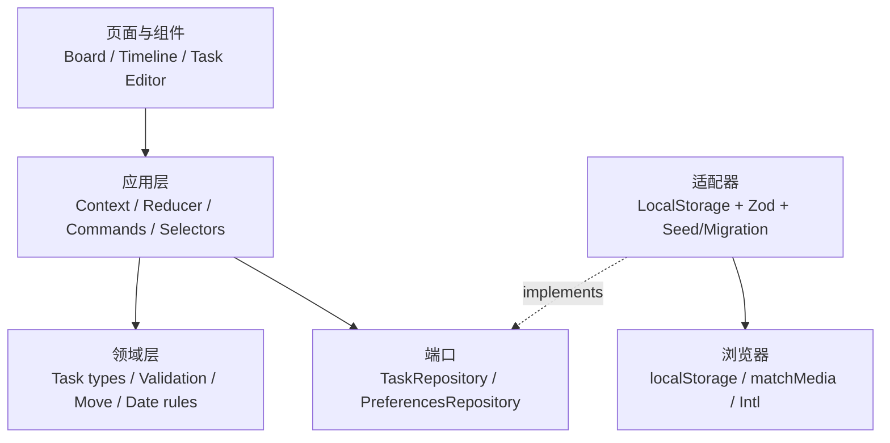
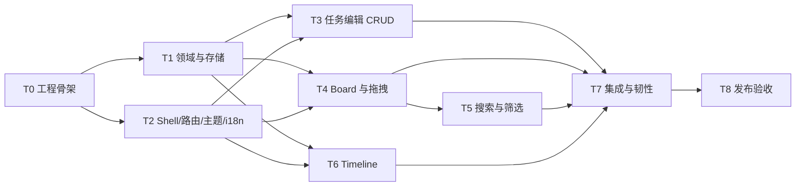

# ForceTrack MVP 技术设计与实施计划

> 文档版本：v1.0  
> 日期：2026-08-11  
> 关联需求：[PRD.md](./PRD.md)  
> 实施周期：单人 1 个工作日（约 8 小时）  
> 目标：交付可运行、可测试、可逐步验收，并能平滑演进到云端协作的客户端 MVP

## 1. 技术目标与约束

### 1.1 技术目标

- 完成任务创建、编辑、删除、流转和持久化的完整闭环。
- Board 与 Timeline 使用同一份领域状态，避免跨视图数据不一致。
- 中英文、主题和浏览器本地数据刷新后保持。
- 核心规则由纯函数承载并可快速单元测试。
- 页面组件不直接依赖 `localStorage`，未来可替换为远程 API。
- 每个实施任务都有独立输出和验收门槛，失败时尽早暴露。

### 1.2 工程约束

- 当前项目目录仅有产品文档，无既有代码和框架限制。
- MVP 为纯前端单页应用，不建设服务端、数据库或真实认证。
- 首要验收环境为桌面端最新版 Chrome，主视口为 1280×720。
- 目标数据量为 100 条以内任务，不为更大规模提前引入虚拟列表或复杂缓存。
- 所有 P1 功能必须在 P0 完整通过后才能开始。

## 2. 技术选型结论

### 2.1 运行环境与版本基线

以下版本为 2026-08-11 的实现基线。初始化后必须提交 `pnpm-lock.yaml`，后续构建以锁文件为准，不自动追随最新版本。

| 类别 | 选择 | 基线版本 | 用途 |
| --- | --- | ---: | --- |
| 运行时 | Node.js | 24.x | 本地开发、构建和测试 |
| 包管理器 | pnpm | 10.x | 快速、确定性依赖安装 |
| UI 框架 | React | 19.2.x | 组件化客户端界面 |
| 语言 | TypeScript | 7.0.x，strict | 领域模型、动作和组件契约 |
| 构建工具 | Vite | 8.2.x | 开发服务器与静态生产构建 |
| 路由 | React Router | 8.3.x，Declarative Mode | `/board`、`/timeline` 和回退路由 |
| 样式 | Tailwind CSS | 4.3.x | 快速实现布局与状态样式 |
| 设计令牌 | CSS custom properties | 原生 | 明暗主题和语义色 |
| 拖拽 | `@dnd-kit/core` + `@dnd-kit/sortable` | 6.3.x / 10.0.x | 多列拖拽、列内排序和键盘传感器 |
| 国际化 | i18next + react-i18next | 26.3.x / 17.0.x | 中英文资源和即时切换 |
| 日期计算 | date-fns | 4.4.x | 日期范围、日历日差和逾期判断 |
| 运行时校验 | Zod | 4.4.x | 本地存储数据校验与损坏恢复 |
| 弹窗基础能力 | Radix Dialog | 1.1.x | 焦点锁定、Escape、无障碍语义 |
| 图标 | Lucide React | 1.31.x | 统一的轻量图标 |
| 单元/组件测试 | Vitest + Testing Library | 4.1.x / 16.3.x | 领域逻辑和关键组件行为 |
| 端到端测试 | Playwright | 1.62.x | 真实浏览器主流程与持久化验证 |
| 代码质量 | ESLint + Prettier | 10.8.x / 3.9.x | 静态检查与统一格式 |

安装时允许使用同一主版本内更新的补丁版本；若出现 peer dependency 或类型不兼容，优先回退单个依赖，而不是更换整体架构。

### 2.2 选择理由

#### React + TypeScript + Vite

- 应用是交互密集型客户端界面，组件状态、拖拽和双视图共享数据适合 React。
- TypeScript 的联合类型可以固定任务状态和优先级，减少字符串状态漂移。
- Vite 官方提供 React + TypeScript 模板和 React 插件，初始化成本低，适合一天时间盒。
- 使用 SPA 而非 SSR：本产品没有 SEO、服务端数据加载或首屏个性化要求，SSR 只会增加部署和调试面。

#### React Router Declarative Mode

- Board 与 Timeline 需要可直接访问、可刷新保持的 URL。
- Declarative Mode 只提供当前所需的路由、导航和选中态，不引入服务端 loader/action。
- 默认路由 `/` 重定向至 `/board`，未知路径重定向至 `/board`。

#### React Context + `useReducer`，不引入 Redux/Zustand

- 100 条以内任务和两个主页面不需要复杂状态框架。
- reducer 和 selectors 可以作为纯函数测试，动作边界清楚。
- Repository 独立处理持久化，使状态层不与 `localStorage` 绑定。
- 后续出现服务端缓存、乐观更新和多人同步时，再评估 TanStack Query 或专用状态方案。

#### Tailwind CSS + CSS 语义令牌

- Tailwind 用于快速完成布局、间距、响应式和交互状态。
- 颜色不直接散落为具体色值，而映射到 `--surface`、`--text`、`--border`、`--accent`、`--danger` 等变量。
- `html[data-theme]` 控制主题，Tailwind 类消费语义变量，后续替换品牌色不需要重写组件。
- 不引入完整组件库；MVP 只使用 Radix Dialog 解决最容易出错的弹窗焦点管理，其余使用原生语义控件。

#### dnd-kit

- Sortable preset 支持单列和多容器排序，并提供 Pointer 与 Keyboard sensors。
- 空列显式注册为 droppable，保证任务能移入空状态列。
- 仅在 `onDragEnd` 提交持久化变更；拖拽过程中的预览是临时 UI 状态，避免高频写存储。
- 任务详情中的状态下拉框始终保留，既是键盘替代路径，也是拖拽异常时的可靠兜底。

#### i18next + react-i18next

- 所有固定文案以稳定 key 管理，组件不保存中英文字符串分支。
- 仅打包 `zh-CN` 与 `en-US` 两份本地 JSON，不接远程翻译服务。
- 浏览器语言识别使用少量自有逻辑，不额外引入 language detector。

#### Vitest + Testing Library + Playwright

- Vitest 与 Vite 共享模块解析和 TypeScript/JSX 配置，适合快速测试纯逻辑与组件。
- Testing Library 按用户可见角色、标签和文本测试交互，减少对 DOM 实现细节的依赖。
- Playwright 验证真实浏览器中的拖拽、本地持久化、路由、主题和跨视图同步。

### 2.3 暂不选择的方案

| 方案 | 本次不选原因 | 何时重新评估 |
| --- | --- | --- |
| Next.js / React Router Framework Mode | 无 SSR、SEO、服务端 action 需求，增加工程面 | 接入后端、鉴权或需要 SSR 时 |
| Redux Toolkit / Zustand | 当前状态规模小，Context + reducer 已足够 | 实时协作、复杂异步缓存或性能出现证据时 |
| IndexedDB | 100 条任务可由 `localStorage` 满足，IndexedDB 测试成本更高 | 附件、离线队列或大数据量时 |
| 完整 UI 组件库 | 视觉定制和依赖体积超出 MVP 所需 | 表单与复杂组件数量显著增长时 |
| 甘特图库 | Timeline 仅需只读日期条，引入后会增加样式与授权评估 | 需要依赖、缩放、拖拽排期时 |
| 后端/API Mock 框架 | MVP 无网络请求，不需要 MSW | 开始接入真实 API 时 |

## 3. 总体架构

### 3.1 分层



依赖只允许从上层指向下层契约：

- 页面组件通过 commands 触发业务动作，不直接调用 `localStorage`。
- reducer 只接收已定义 action，不包含 DOM、路由或存储副作用。
- 日期、筛选、排序、校验均为独立纯函数。
- Repository 返回领域对象或明确错误，不向 UI 泄露原始 JSON。

### 3.2 状态与数据流

```text
用户操作
  → command 校验输入
  → 生成下一个领域状态
  → reducer 更新内存状态
  → repository 保存版本化快照
  → 保存失败则保留当前界面状态，并显示“刷新后可能丢失”的非阻塞错误
```

启动流程：

1. `LocalTaskRepository.load()` 读取并校验存储快照。
2. 无数据时写入演示数据。
3. 数据合法时 hydrate 应用状态。
4. 数据损坏时备份损坏字符串到单独 key、恢复演示数据并返回 `recovered` 状态。
5. UI 展示一次非阻塞恢复提示，应用不得白屏。

### 3.3 路由

| URL | 页面 | 行为 |
| --- | --- | --- |
| `/` | 无 | 重定向至 `/board` |
| `/board` | Board | 默认主页面 |
| `/timeline` | Timeline | 时间线页面 |
| `*` | 无 | 重定向至 `/board` |

任务详情不写入独立路由，MVP 使用应用级 Dialog。后续需要分享任务链接时，再增加 `/tasks/:taskId` 并复用同一编辑组件。

## 4. 目录与模块设计

```text
ForceTrack/
├── e2e/
│   ├── board.spec.ts
│   ├── preferences.spec.ts
│   └── timeline.spec.ts
├── public/
├── src/
│   ├── app/
│   │   ├── App.tsx
│   │   ├── AppProviders.tsx
│   │   └── routes.tsx
│   ├── components/
│   │   ├── AppHeader.tsx
│   │   ├── EmptyState.tsx
│   │   └── FeedbackBanner.tsx
│   ├── features/
│   │   ├── board/
│   │   │   ├── BoardPage.tsx
│   │   │   ├── BoardColumn.tsx
│   │   │   ├── TaskCard.tsx
│   │   │   └── board-dnd.ts
│   │   ├── filters/
│   │   │   ├── FilterBar.tsx
│   │   │   └── task-selectors.ts
│   │   ├── task-editor/
│   │   │   ├── TaskDialog.tsx
│   │   │   ├── TaskForm.tsx
│   │   │   └── task-validation.ts
│   │   └── timeline/
│   │       ├── TimelinePage.tsx
│   │       ├── TimelineGrid.tsx
│   │       └── timeline-range.ts
│   ├── domain/
│   │   ├── task.ts
│   │   ├── member.ts
│   │   ├── actions.ts
│   │   └── task-reducer.ts
│   ├── infrastructure/
│   │   ├── repositories.ts
│   │   ├── local-task-repository.ts
│   │   ├── local-preferences-repository.ts
│   │   ├── storage-schema.ts
│   │   └── seed-data.ts
│   ├── i18n/
│   │   ├── index.ts
│   │   └── locales/
│   │       ├── en-US.json
│   │       └── zh-CN.json
│   ├── styles/
│   │   ├── index.css
│   │   └── tokens.css
│   ├── test/
│   │   ├── setup.ts
│   │   └── fixtures.ts
│   └── main.tsx
├── index.html
├── playwright.config.ts
├── vite.config.ts
├── vitest.config.ts
└── package.json
```

测试文件优先与被测模块同目录放置，例如 `task-reducer.test.ts`；`src/test` 只存放通用 setup 和 fixtures。

## 5. 关键技术设计

### 5.1 领域模型

沿用 PRD 的 `Task`、`Member`、`UserPreferences`，增加应用快照版本：

```ts
interface TaskSnapshotV1 {
  schemaVersion: 1;
  nextTaskNumber: number;
  tasks: Task[];
  members: Member[];
}

interface TaskRepository {
  load(): Promise<LoadResult>;
  save(snapshot: TaskSnapshotV1): Promise<void>;
}

type LoadResult =
  | { kind: "loaded"; snapshot: TaskSnapshotV1 }
  | { kind: "seeded"; snapshot: TaskSnapshotV1 }
  | { kind: "recovered"; snapshot: TaskSnapshotV1 };
```

Repository 即使使用同步 `localStorage` 也返回 Promise，使未来远程实现无需改变调用方函数签名。

### 5.2 Action 与 reducer

最小 action 集：

```ts
type TaskAction =
  | { type: "hydrate"; payload: TaskSnapshotV1 }
  | { type: "task/created"; payload: Task }
  | { type: "task/updated"; payload: Task }
  | { type: "task/deleted"; payload: { taskId: string } }
  | {
      type: "task/moved";
      payload: { taskId: string; toStatus: TaskStatus; toIndex: number };
    };
```

规则：

- `id` 使用 `crypto.randomUUID()`；展示编号使用快照内 `nextTaskNumber` 生成 `FT-n`。
- 创建、编辑和移动均更新 `updatedAt`。
- 移动后仅对来源列和目标列的 `position` 重新编号为连续整数。
- reducer 不读当前时间；command 生成时间并随 payload 传入，保证测试确定性。
- 任何 action 不得原地修改 state。

### 5.3 本地存储

存储 key：

| Key | 内容 |
| --- | --- |
| `forcetrack:tasks:v1` | `TaskSnapshotV1` |
| `forcetrack:preferences:v1` | `UserPreferences` |
| `forcetrack:recovery:last-invalid` | 最近一次损坏的原始数据，仅用于调试 |

要求：

- 读取后使用 Zod 校验，不能直接 `JSON.parse(...) as TaskSnapshotV1`。
- 只有 key 不存在时才生成 seed；合法空数组代表用户确实删除了所有任务。
- 写入采用完整快照，100 条以内数据不需要增量日志。
- 捕获 JSON 解析、安全模式、配额和不可用存储错误。
- 未来新增 schema 时，通过 `schemaVersion` 逐版本迁移，禁止原地猜测字段。

### 5.4 表单与校验

- 使用受控表单和一个局部 draft，不引入表单框架。
- 标题先 `trim()`，结果长度必须为 1–100。
- 描述最多 2,000 字符。
- 日期保存为 `YYYY-MM-DD`，表示本地日历日期，不转换为 UTC 时间戳。
- 同时有开始和截止日期时，`dueDate >= startDate`。
- 是否有未保存修改通过规范化后的 draft 与原任务比较。
- 放弃修改确认使用应用内 Dialog，不调用阻塞式 `window.confirm`。

### 5.5 Board 与拖拽

- 每个状态列一个 `SortableContext`，外层列容器始终是 droppable。
- 使用 PointerSensor 和 KeyboardSensor；键盘坐标使用 sortable preset 提供的策略。
- `onDragStart` 只记录 active task，`onDragOver` 只更新视觉目标，`onDragEnd` 计算一次最终 action。
- 拖到列空白区域时插入末尾；拖到卡片时使用目标卡片索引。
- 搜索/筛选开启时仍允许跨列改变状态，但列内排序以完整未过滤列表中的相对位置计算，避免隐藏任务丢失或顺序跳变。
- 拖拽屏幕阅读器说明和状态播报必须进入中英文翻译资源。
- 若列内排序在时间盒内不稳定，按 PRD 取舍为只保留跨列拖拽并按 `updatedAt` 排序，不提交半稳定排序。

### 5.6 搜索与筛选

筛选状态只属于 Board 页面，不持久化：

```ts
interface BoardFilters {
  query: string;
  priorities: TaskPriority[];
  assigneeId: string | "unassigned" | null;
}
```

- 标题和编号使用规范化后的 lowercase 包含匹配。
- 搜索、优先级、负责人为 AND；多个优先级内部为 OR。
- selectors 返回新的展示数组，但不得修改原始任务顺序。
- “清除”恢复空 query、空优先级和全部负责人。

### 5.7 Timeline

不使用 Canvas 或甘特图库，采用 CSS Grid：

- 左侧任务信息列固定宽度 260 px。
- 日期单元宽度 36 px，日期头和任务条共享同一 grid 坐标。
- 基础范围为今天前 7 天至后 13 天，共 21 天。
- 若任务日期超出基础范围，则扩展到最早开始日和最晚截止日，并各增加 2 天边距；最大渲染跨度 366 天。
- 超过 366 天的异常跨度裁剪到边界，并显示“超出可视范围”标记。
- 单日期任务按 1 天宽度展示；无日期任务进入“未排期”区域。
- 日期条位置由 `differenceInCalendarDays` 计算，禁止以毫秒数除以 24 小时，避免夏令时导致偏移。
- “今天”按钮通过日期列 ref 调用 `scrollIntoView({ inline: "center" })`。
- 逾期定义为 `dueDate < today && status !== "done"`，同时显示警示图标和本地化文字。

### 5.8 国际化

- key 按领域分组：`nav.*`、`board.*`、`task.*`、`timeline.*`、`validation.*`、`a11y.*`。
- 两份语言文件 key 必须完全一致，由测试递归比较。
- 首次语言：`navigator.language` 以 `zh` 开头则为 `zh-CN`，否则为 `en-US`。
- 用户切换后写入 preferences；后续浏览器语言变化不覆盖显式选择。
- 用户内容不翻译；状态、优先级、日期和系统消息通过资源/`Intl` 本地化。
- `document.documentElement.lang` 随切换更新。

### 5.9 主题

- preference 支持 `light | dark | system`。
- `system` 通过 `matchMedia('(prefers-color-scheme: dark)')` 得出有效主题并监听变化。
- 在 `index.html` 中于 React 挂载前读取 preference 并设置 `data-theme`，减少主题闪烁。
- CSS 至少定义：页面背景、表面、悬浮表面、正文、次要文字、边框、强调、危险、警告、成功和焦点环。
- 组件仅使用语义令牌，不直接使用 `text-black`、`bg-white` 等主题耦合类。

### 5.10 错误处理

- 根组件提供 Error Boundary，意外渲染错误显示可恢复页面和重新加载按钮。
- 存储加载损坏：恢复 seed，并显示一次 warning banner。
- 存储保存失败：内存状态继续可用，warning banner 保持到下一次成功保存或刷新。
- 用户输入错误：字段就地展示，不使用全局 toast。
- 不在生产界面展示原始异常堆栈或存储内容。

## 6. 测试策略

### 6.1 测试分层

| 层级 | 工具 | 重点 | MVP 目标 |
| --- | --- | --- | --- |
| 静态检查 | TypeScript、ESLint、Prettier | 类型、规则、格式 | 每次验收必跑 |
| 单元测试 | Vitest | reducer、校验、selectors、日期和存储 schema | 领域分支优先覆盖 |
| 组件测试 | Testing Library + jsdom | 表单、筛选、语言/主题控件、空状态 | 验证用户可见行为 |
| E2E | Playwright Chromium | CRUD、拖拽、持久化、跨视图、偏好 | 覆盖 5 条 P0 主流程 |
| 人工探索 | 最新 Chrome | 视觉、拖拽手感、键盘和响应式 | 发布前一次完整走查 |

覆盖率不是发布的唯一标准，但建议设置：

- `src/domain`、校验、selectors、timeline-range：语句和分支覆盖率不低于 90%。
- 全局语句覆盖率不低于 75%。
- 不为提高数字测试纯展示代码，优先覆盖会造成数据丢失或错序的规则。

### 6.2 必测用例

#### 领域与存储单元测试

1. 创建任务生成唯一 `id`、连续 `FT-n` 和默认值。
2. 编辑任务更新时间，且不改变 `id`、`key`、`createdAt`。
3. 删除只影响目标任务。
4. 跨列移动更新状态与两列 position，任务不丢失、不重复。
5. 空列可接收任务；同列首、中、尾排序正确。
6. 标题空白、超长标题、超长描述和反向日期范围被拒绝。
7. 搜索不区分大小写，编号和标题均可匹配。
8. 搜索、优先级和负责人筛选满足 AND/OR 规则。
9. 单日期、跨月、跨年和夏令时附近的日期条位置正确。
10. 无 key 时 seed；合法空数组不 seed；损坏 JSON 和错误 schema 可恢复。
11. 中英文资源 key 完全一致。

#### 组件测试

1. TaskDialog 初始焦点、错误提示、保存、取消和脏表单二次确认。
2. 状态下拉框可以在不拖拽时更新任务状态。
3. FilterBar 组合条件、结果数和一键清除。
4. 语言切换后标签及 `html[lang]` 更新，用户输入文本不变。
5. 主题选择更新 `data-theme`，system 模式响应 mock `matchMedia`。

#### E2E 主流程

1. **CRUD 与持久化**：创建任务 → 编辑 → 刷新 → 数据保留 → 删除。
2. **Board 流转**：将任务拖到另一列 → 计数更新 → 刷新后位置保留。
3. **搜索筛选**：组合关键词、优先级和负责人 → 结果正确 → 清除恢复。
4. **Board/Timeline 一致性**：设置日期 → Timeline 出现正确日期条 → 再编辑后同步。
5. **偏好持久化**：切英文和深色 → 刷新 → 语言、主题和 `html` 属性保留。

可追加但不阻塞首日发布：损坏 localStorage 恢复和 768 px 响应式 E2E。

### 6.3 测试隔离与稳定性

- 每个单元测试使用固定时间和显式 fixture，不依赖真实当前日期。
- Playwright 每条用例开始前清理 ForceTrack keys；需要 seed 的测试让应用自行初始化。
- E2E 使用 role、label、稳定任务 key 或 `data-testid` 定位；仅在拖拽目标缺少语义定位时使用 test id。
- 不使用固定 `sleep`；使用 Playwright 自动等待和可见状态断言。
- 拖拽 E2E 失败时保存 trace、截图和 video-on-first-retry。
- 首日 CI/本地默认只跑 Chromium；Safari/Firefox 属于后续兼容性回归。

### 6.4 标准命令

`package.json` 需要提供以下稳定入口：

```bash
pnpm dev
pnpm format:check
pnpm lint
pnpm typecheck
pnpm test
pnpm test:coverage
pnpm test:e2e
pnpm build
pnpm check
```

其中 `pnpm check` 顺序执行：

```text
format:check → lint → typecheck → test --run → build
```

E2E 独立运行，避免每次小改动都启动浏览器；里程碑和最终发布必须执行 `pnpm test:e2e`。

## 7. 任务拆解与逐步验收

### 7.1 依赖关系



T1 与 T2 可相对独立推进；T3、T4、T6 在领域契约稳定后也可分别开发。每个任务建议形成一个可审查提交，提交前满足自身验收条件。

### T0：工程骨架与质量门禁（0.5 小时）

**目标**：建立可运行、可检查、可测试的最小工程。

**工作内容**：

- 使用 Vite React TypeScript 模板初始化当前目录。
- 配置 pnpm、Node engines、TypeScript strict、ESLint、Prettier、Vitest/jsdom 和 Playwright。
- 接入 Tailwind Vite 插件与基础 CSS reset。
- 建立上述目录骨架、脚本与 `.gitignore`。
- 建立最小 smoke test。

**独立输出**：应用显示 ForceTrack 占位页，测试和生产构建可运行。

**验收**：

- [ ] `pnpm dev` 可启动，访问页面无控制台错误。
- [ ] `pnpm check` 全部通过。
- [ ] `pnpm test:e2e` 至少有一条首页 smoke test 通过。
- [ ] 锁文件已生成，版本与第 2.1 节基线一致。

**失败即停止**：构建、类型检查或浏览器测试基础设施未稳定前，不进入功能开发。

### T1：领域模型、reducer 与本地 Repository（0.75 小时）

**依赖**：T0。

**目标**：提供所有页面共用、与 UI 无关的数据能力。

**工作内容**：

- 定义 Task、Member、Preferences、Snapshot、Action 类型。
- 实现创建、更新、删除、移动和重排纯函数/reducer。
- 实现 Zod schema、seed、load/save 和损坏恢复。
- 为时间注入、ID 和 fixtures 提供可测试接口。
- 完成领域与存储必测用例。

**独立输出**：即使没有 Board 页面，也能通过测试证明任务生命周期和持久化规则正确。

**验收**：

- [ ] CRUD、移动、重排、编号和日期校验单测通过。
- [ ] 首次 seed、合法空数据、损坏恢复和保存失败测试通过。
- [ ] 任意 action 后任务 ID 集合无重复，position 在列内连续。
- [ ] UI 目录中没有 `localStorage` 调用。

### T2：应用 Shell、路由、国际化与主题（0.75 小时）

**依赖**：T0；可与 T1 并行。

**目标**：建立两页导航和全局偏好基础设施。

**工作内容**：

- 实现 AppProviders、Header、Board/Timeline 空页面和路由回退。
- 建立中英文资源、默认语言策略和语言切换。
- 建立语义颜色令牌、light/dark/system 主题和预挂载主题脚本。
- 实现偏好 Repository 和基础组件测试。

**独立输出**：可在两个 URL 间导航，并可靠切换语言/主题。

**验收**：

- [ ] `/`、`/board`、`/timeline` 和未知路径行为正确。
- [ ] 中英文切换即时生效，两份资源 key 一致。
- [ ] light/dark/system 均改变有效主题，刷新后保持。
- [ ] `html[lang]` 与 `html[data-theme]` 正确。
- [ ] 1280×720 下 Header 无溢出。

### T3：任务编辑与 CRUD UI（1 小时）

**依赖**：T1、T2。

**目标**：完成不依赖拖拽的任务管理闭环。

**工作内容**：

- 实现 Radix TaskDialog 和 TaskForm。
- 接入新建、查看、编辑、删除及删除确认。
- 实现必填、长度、日期校验与脏表单确认。
- 提供状态下拉框作为完整替代操作路径。
- 补齐 TaskDialog 组件测试。

**独立输出**：可通过临时任务列表或开发入口完整操作任务。

**验收**：

- [ ] 新建、编辑、删除后 Repository 快照正确。
- [ ] 无效输入不能保存，焦点移至或关联到错误字段。
- [ ] 未保存修改关闭时出现二次确认。
- [ ] Dialog 支持 Tab 焦点循环、Escape 和关闭后焦点返回。
- [ ] 所有字段、校验和确认文案均有中英文。

### T4：Board 渲染与拖拽（1.25 小时）

**依赖**：T1、T2；可与 T3、T6 分开开发。

**目标**：交付四列看板和可靠状态流转。

**工作内容**：

- 实现 BoardPage、四个 BoardColumn、TaskCard 和列计数。
- 接入 Pointer/Keyboard sensors、跨列移动和列内排序。
- 支持空列 droppable、DragOverlay 和明确的放置反馈。
- 卡片点击打开 T3 编辑器；T3 未完成时可先以回调契约或 stub 联调。
- 增加 reducer 级 DnD 映射测试与一条跨列 E2E。

**独立输出**：使用 seed 数据即可完整演示任务状态推进。

**验收**：

- [ ] 四列和计数正确，空列仍可接收任务。
- [ ] 跨列和同列拖拽不丢失、不重复任务。
- [ ] 刷新后状态及顺序保持。
- [ ] 键盘 sensor 可操作，且状态下拉框替代路径可用。
- [ ] 任务卡片只显示 PRD 指定的摘要信息。

**时间盒降级**：45 分钟内列内排序仍不稳定时，关闭列内自由排序，只保留跨列移动并按更新时间排序；记录为已知限制。

### T5：搜索与筛选（0.5 小时）

**依赖**：T1、T4。

**目标**：在不改变原数据的前提下定位任务。

**工作内容**：

- 实现纯 selectors 和 Board FilterBar。
- 支持标题/编号、多个优先级、负责人/未分配组合。
- 展示结果数、无结果状态和清除按钮。
- 覆盖组合规则单元测试和关键组件测试。

**独立输出**：过滤层只接收任务数组并返回展示结果，可脱离 Board 测试。

**验收**：

- [ ] 大小写、标题和编号搜索正确。
- [ ] 条件满足“类别间 AND、多个优先级 OR”。
- [ ] 清除后恢复全部任务。
- [ ] 筛选前后原任务数组、状态和 position 不变。
- [ ] 无结果状态在中英文下均完整。

### T6：简化 Timeline（1 小时）

**依赖**：T1、T2；可与 T3、T4 分开开发。

**目标**：只读展示任务排期，并与任务编辑共享实体。

**工作内容**：

- 实现日期范围纯函数、日期头、任务行和日期条。
- 实现未排期区、今天高亮、今天定位和逾期标记。
- 点击任务行/日期条打开统一编辑器；T3 未完成时使用回调契约。
- 增加日期边界单测和 Timeline E2E。

**独立输出**：给定任务 fixtures 即可独立渲染和验证时间线。

**验收**：

- [ ] 双日期、单日期和无日期任务展示正确。
- [ ] 跨月、跨年及夏令时边界单测通过。
- [ ] 今天列突出显示，“今天”按钮可定位。
- [ ] 逾期且未完成任务同时有颜色与文字/图标提示。
- [ ] 编辑日期后无需刷新即可更新日期条。

**时间盒降级**：保留只读日期条和详情内日期编辑，不实现任何轴上拖动、缩放或依赖。

### T7：集成、响应式、无障碍与恢复状态（1 小时）

**依赖**：T3–T6。

**目标**：将功能模块收敛为稳定完整的产品体验。

**工作内容**：

- 联调 Board、TaskDialog、filters 和 Timeline 的单一数据源。
- 完成加载、空列、无任务、无筛选结果、未排期和存储错误状态。
- 完成 1280×720 主视口、768–1279 px 横向滚动和小屏可访问兜底。
- 检查键盘焦点、label、对比度、拖拽播报和中英文漏翻。
- 增加根 Error Boundary 与反馈 banner。

**独立输出**：完整应用达到 PRD P0 功能形态。

**验收**：

- [ ] Board 和 Timeline 修改同一任务后立即一致。
- [ ] 所有异常/空状态不会白屏或阻断其他功能。
- [ ] 1280×720 无遮挡；768 px 可通过横向滚动访问全部列。
- [ ] 仅键盘可完成导航、CRUD 和状态修改。
- [ ] 中英文与两种有效主题下完成一次主流程走查。

### T8：自动化回归与发布验收（1.25 小时）

**依赖**：T7。

**目标**：冻结功能，用证据确认 MVP 可以交付。

**工作内容**：

- 完成第 6.2 节五条 E2E 主流程。
- 跑全量静态检查、单元/组件测试、E2E 和生产构建。
- 在最新版 Chrome 以 1280×720 人工执行 PRD 验收清单。
- 检查控制台错误、刷新持久化、主题闪烁和拖拽手感。
- 创建 `ACCEPTANCE.md`，记录命令、结果、日期、环境和已知限制。
- 更新 README 的启动、测试、构建和数据存储说明。

**独立输出**：可复核的发布候选版本和验收记录。

**验收**：

- [ ] `pnpm check` 退出码为 0。
- [ ] `pnpm test:coverage` 满足阈值。
- [ ] `pnpm test:e2e` 五条 P0 流程全部通过。
- [ ] `pnpm build` 生成可由静态服务器托管的 `dist/`。
- [ ] PRD 第 12 节全部 P0 项有对应证据或明确限制。
- [ ] 无阻塞级缺陷；P1 未完成不影响发布。

## 8. 分阶段验收门禁

| Gate | 包含任务 | 可演示结果 | 必须通过后才能进入 |
| --- | --- | --- | --- |
| G0 工程可运行 | T0 | 占位页、测试和构建 | 任何功能开发 |
| G1 基础能力稳定 | T1 + T2 | 数据规则、双路由、双语、主题 | CRUD、Board、Timeline 联调 |
| G2 核心闭环 | T3 + T4 | 创建任务并拖拽推进，刷新保留 | 搜索与整体验收 |
| G3 双视图完成 | T5 + T6 | 筛选任务并查看排期 | 产品级收尾 |
| G4 发布候选 | T7 | 完整 P0 界面与恢复能力 | 最终回归 |
| G5 MVP 完成 | T8 | 自动化和人工验收证据 | 发布 |

每个 Gate 的处理规则：

1. 先执行该阶段自动化检查，再进行最短人工演示。
2. 若失败，修复当前 Gate，不带着失败进入下一阶段。
3. 验收通过后记录提交 SHA 和命令结果，便于回退和定位。
4. 最后 45 分钟不接受新增范围，只处理阻塞缺陷、构建和验收证据。

## 9. Definition of Done

一个任务只有同时满足以下条件才算完成：

- 实现内容符合本任务描述且没有暗含 P1 范围。
- 新增业务规则有单元测试，新增关键交互有组件或 E2E 覆盖。
- `pnpm lint`、`pnpm typecheck` 和相关测试通过。
- 无新增浏览器控制台 error。
- 中英文和主题影响已检查；用户可见固定文本没有硬编码遗漏。
- 代码未绕过 Repository 直接访问存储。
- 任务自己的验收清单已逐项确认。
- 如有降级或限制，已写入 `ACCEPTANCE.md`，而不是隐藏失败。

## 10. 发布与后续演进

### 10.1 MVP 发布形态

- 输出 Vite 静态构建 `dist/`，可部署到任意静态托管平台。
- SPA 托管需要将未知路径回退至 `index.html`，保证 `/board` 和 `/timeline` 刷新可用。
- MVP 不配置秘密环境变量，不包含后端地址或认证密钥。

### 10.2 后端演进路径

1. 新增 HTTP `TaskRepository`，保持应用层 commands 不变。
2. 将完整快照保存改为按 task 的 CRUD API，并引入服务端版本号。
3. 引入认证后由 `IdentityProvider` 提供当前用户和项目上下文。
4. 引入 TanStack Query 管理服务端缓存、重试和乐观更新。
5. 实时协作阶段增加 WebSocket/SSE 事件和冲突策略；reducer action 可作为客户端事件基础。

### 10.3 需要避免的过度设计

- MVP 不建立通用插件系统、事件总线、微前端或 monorepo。
- 不为尚不存在的 API 编写完整网络抽象和 mock server。
- 不为 100 条以内任务引入虚拟化、复杂 memo 或 worker。
- 不提前实现权限字段、评论结构、依赖图或 Sprint 实体。
- 演进能力来自明确模块边界与稳定契约，而不是预先实现未来功能。

## 11. 风险与应对

| 风险 | 影响 | 预防/应对 |
| --- | --- | --- |
| 多列拖拽和过滤同时存在时错序 | 数据顺序异常 | 用纯函数映射完整列表；E2E 覆盖过滤开启时移动；必要时降级列内排序 |
| 日期按时间戳计算导致偏移 | Timeline 条错一格 | 保存 date-only 字符串，使用 calendar-day API，测试 DST/跨年 |
| localStorage 损坏导致白屏 | 用户无法进入应用 | Zod 校验、恢复 seed、Error Boundary 和恢复测试 |
| 主题首次加载闪烁 | 体验不一致 | React 挂载前设置 `data-theme` |
| 中英文 key 漏失 | 界面出现 key 或混合语言 | 自动比较资源 key，开发环境 missing-key 报错 |
| 一天内范围膨胀 | P0 无法验证 | 固定任务时间盒、Gate 验收、最后 45 分钟冻结范围 |
| E2E 拖拽偶发失败 | 验收结果不可信 | 稳定定位、等待 UI 状态、保留 trace，不使用固定 sleep |

## 12. 技术参考

- [Vite Getting Started](https://vite.dev/guide/)：React TypeScript 模板、Node 版本要求与构建入口。
- [Vite TypeScript Features](https://vite.dev/guide/features.html#typescript)：Vite 只转译 TypeScript，生产检查需单独执行 `tsc --noEmit`。
- [React Router Declarative Mode](https://reactrouter.com/start/modes)：轻量客户端路由模式的能力边界。
- [Tailwind CSS with Vite](https://tailwindcss.com/docs/installation/using-vite)：使用 `@tailwindcss/vite` 的官方接入方式。
- [dnd-kit Sortable](https://docs.dndkit.com/presets/sortable)：多容器排序、SortableContext 与键盘坐标策略。
- [dnd-kit Accessibility](https://docs.dndkit.com/guides/accessibility)：键盘操作、说明和 live region 播报要求。
- [react-i18next Quick Start](https://react.i18next.com/guides/quick-start)：i18next 与 React context 的标准接入方式。
- [Vitest Features](https://vitest.dev/guide/features)：Vite 配置复用、jsdom 和覆盖率能力。
- [Playwright Writing Tests](https://playwright.dev/docs/writing-tests)：自动等待、隔离和面向用户行为的断言方式。
