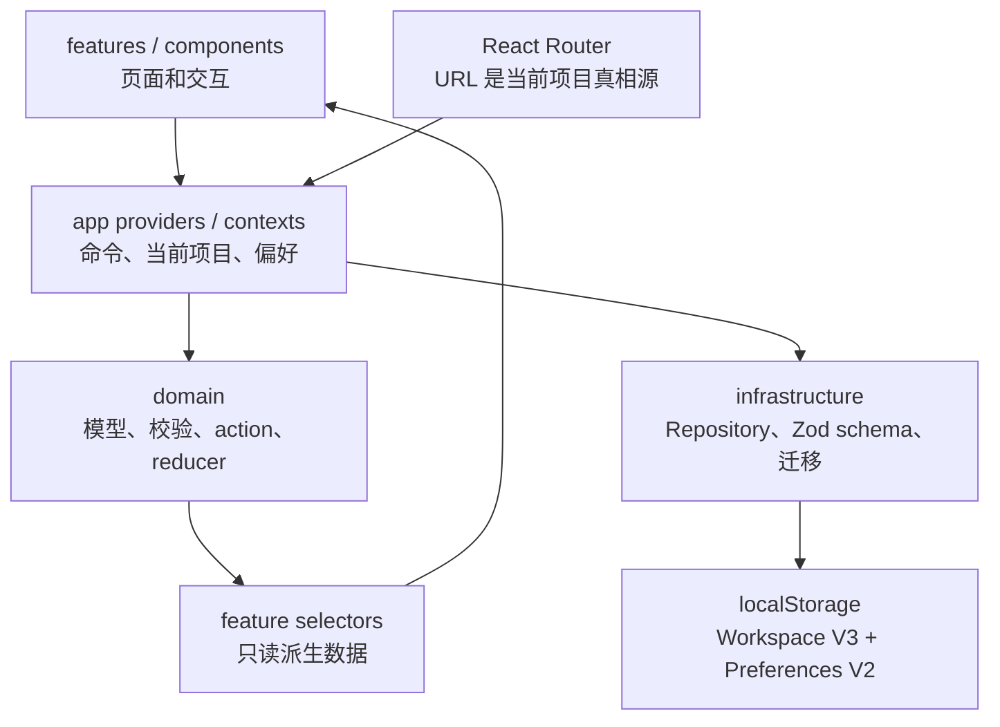
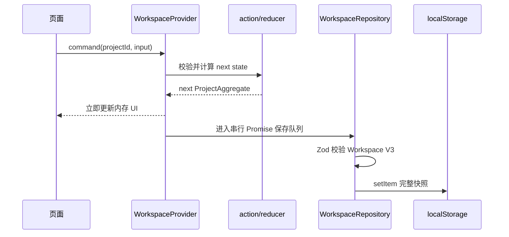

# 系统架构

## 技术栈

- React 19、TypeScript、Vite 8
- React Router 8
- React Context + reducer
- Tailwind CSS 4 + CSS 语义令牌
- shadcn/ui 风格组件，底层使用 Radix primitives
- dnd-kit
- Zod
- i18next / react-i18next
- Vitest、Testing Library、Playwright

当前产品是 local-first SPA。没有 API 服务、数据库或服务端认证；浏览器中的 Workspace 快照是业务数据的持久化来源。

## 分层



依赖方向保持单向：页面调用 Context 命令，领域层计算状态，Repository 校验并保存。组件不应直接读取 `localStorage`，派生视图也不应把计算结果写回存储。

## 目录职责

| 目录                 | 职责                                                             |
| -------------------- | ---------------------------------------------------------------- |
| `src/app`            | Provider 组合、Context、路由、应用 Shell、引导                   |
| `src/domain`         | Project、Task、Sprint、Member 模型与不变量                       |
| `src/infrastructure` | Repository 接口、本地存储、Zod Schema、旧数据迁移、Seed          |
| `src/features`       | Summary、Backlog、Board、Timeline、Members、Project、Task Editor |
| `src/components`     | 跨功能共享组件和状态反馈                                         |
| `src/components/ui`  | shadcn/ui 控件边界；Radix 仅在这里封装                           |
| `src/i18n`           | i18n 初始化和 `zh-CN` / `en-US` 资源                             |
| `src/styles`         | 全局样式和语义设计令牌                                           |
| `src/test`           | 测试初始化与共享 fixture                                         |
| `e2e`                | Playwright 用户主流程                                            |

`@/*` 映射到 `src/*`。新增代码优先使用此别名，避免深层相对路径。

## Provider 与状态所有权

`AppProviders` 的组合顺序是：

```text
I18nextProvider
└── PreferencesProvider
    └── BrowserRouter
        └── WorkspaceProvider
            └── App
```

`WorkspaceProvider` 是业务状态的唯一所有者，同时向外提供：

- `ProjectContext`：项目集合、当前项目、项目 CRUD、成员操作。
- `TaskContext`：当前项目的 V2 规划视图，以及 Task/Sprint/Backlog 命令。

项目内写操作会捕获 URL 中的 `projectId`，通过既有 action/reducer 更新对应 `ProjectAggregate`，再串行保存整个 Workspace。保存时不能临时读取“当前项目”，否则快速切换项目时可能把写入落到错误项目。

`TaskProvider` 仍保留为兼容和隔离测试入口；生产应用的权威状态拥有者是 `WorkspaceProvider`。

## URL 和项目上下文

- URL 是当前项目和页面的唯一真相源。
- `lastProjectId` 只负责根路径/旧路由恢复，不能覆盖合法 URL。
- 切换项目时保留当前页面类型。
- 未知项目回退到最近有效项目或第一个项目。
- 所有 URL 都通过 `src/app/route-paths.ts` 构造。

## 写入时序



保存失败时，内存中的操作结果仍保留，并显示持久化失败反馈；后续成功写入会清除提示。
