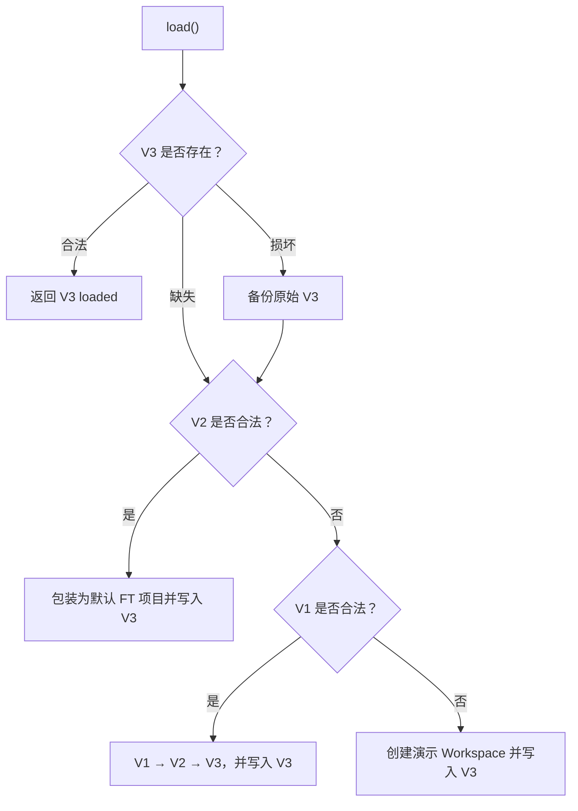

# 存储与迁移

## 当前存储键

| Key                                            | 状态         | 内容                                           |
| ---------------------------------------------- | ------------ | ---------------------------------------------- |
| `forcetrack:workspace:v3`                      | 当前读写     | 全部 Project/Task/Sprint/Member                |
| `forcetrack:preferences:v2`                    | 当前读写     | locale、theme、lastProjectId、recentProjectIds |
| `forcetrack:onboarding:v1`                     | 当前读写     | 首次引导完成标记                               |
| `forcetrack:tasks:v2`                          | 只读迁移输入 | 旧单项目快照                                   |
| `forcetrack:tasks:v1`                          | 只读迁移输入 | 最早的任务快照                                 |
| `forcetrack:preferences:v1`                    | 只读迁移输入 | 旧偏好                                         |
| `forcetrack:recovery:workspace:last-invalid`   | 恢复备份     | 最近一次损坏的 V3 原始字符串                   |
| `forcetrack:recovery:preferences:last-invalid` | 恢复备份     | 最近一次损坏的偏好原始字符串                   |

组件不得直接读写业务存储。业务数据通过 `WorkspaceRepository`，偏好通过 `PreferencesRepository`；首次引导是独立、可降级的 UI 状态。

## Workspace 加载顺序

合法 V3 永远优先，不能被旧数据覆盖。V1/V2 原始字符串不删除、不回写；合法空 Workspace 也不能被误判为首次使用后重新 seed。

## Schema 边界

- `src/infrastructure/storage-schema.ts` 保存冻结的 V1/V2 契约。
- `src/infrastructure/workspace-schema.ts` 校验项目感知的 V3。
- `src/infrastructure/task-migration.ts` 只负责 V1 → V2。
- `src/domain/workspace.ts` 把 V2 规划数据包装为默认 `FT` 项目。
- `src/infrastructure/local-workspace-repository.ts` 编排 V3 → V2 → V1 → seed 的加载顺序。

不要为了支持新项目 Key 去放宽 V2 中固定 `FT-N` 的校验；新规则只进入 V3 Schema。

## V3 重要不变量

Repository 保存前会用 Zod 拒绝不合法快照，包括：

- 重复的 Project ID/Key、实体 ID 或 Task Key。
- Task Key 与所属 Project Key 不匹配。
- 跨项目或不存在的成员、Sprint、Parent 引用。
- 同一项目出现多个 active Sprint。
- Board `position` 或规划区 `rank` 不连续。
- `nextTaskNumber` 没有超过现有最大任务编号。

## 保存一致性

Workspace 使用单一 Key 保存完整快照，避免“项目索引已写但项目内容未写”等跨 Key 半完成状态。Provider 先同步计算 next state、立即更新 UI，再把完整 Workspace 放入串行 Promise 队列。后一笔写入必须基于最新 ref。

## 设计新的 Schema 版本

需要 V4 时：

1. 写清新旧结构、默认值、不可逆变化和回滚策略。
2. 保留 V3 Schema 作为只读迁移输入，不在原 Schema 上就地放宽。
3. 先写迁移 fixture 和边界测试，再接入 Repository。
4. 验证合法空数据、损坏新版本、只有旧版本、重复刷新四类路径。
5. 保留旧 Key，直到有明确的数据保留/清理策略。
6. 同步更新本页、技术设计和 `ACCEPTANCE.md`。

不要把认证 token 放进 `localStorage`。未来接入后端后，服务端应成为业务数据权威来源，浏览器只保存明确可丢弃的草稿和用户偏好。
